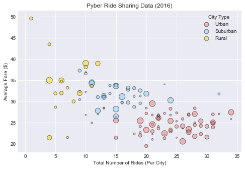
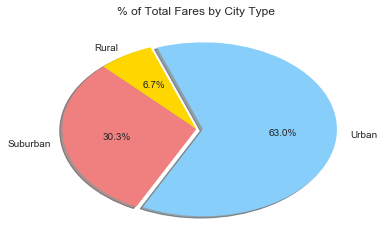
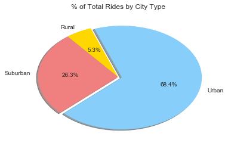
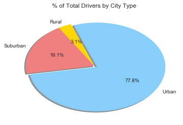

#Data Trend Analysis

1) In general, Urban cities are showing a higher total number of rides per city with lower average fares. 
Rural cities are averaging lower total rides with higher average fares. 

2) Urban cities make up 63% of total fares, but 77.8% of total drivers.  
Suburban cities make up 30.3% of total fares, with only 19.1% of total drivers.
Rural cities make up 6.7% of total fares, with only 3.1% of total drivers. 

3) Urban cities make up 63% of total fares, with 68.4% of total rides. 
Suburban cities make up 30.3% of total fares with 26.3% of total rides.
Rural cities make up 6.7% of total fares with 5.3% of total rides. 


```python
import matplotlib.pyplot as plt
import matplotlib as mpl
import numpy as np
import pandas as pd
import os
import seaborn as sns
```


```python
cityfile = os.path.join("city_data.csv")
ridefile = os.path.join("ride_data.csv")
city_df = pd.read_csv(cityfile)
ride_df = pd.read_csv(ridefile)
```


```python
city_group = city_df.groupby(['city']).agg({'driver_count':'sum', 'type': 'max'})
ride_group = ride_df.groupby(['city']).agg({'ride_id':'count', 'fare':['mean', 'sum']})

ride_summary = pd.DataFrame({"Total Number of Rides": ride_group["ride_id"]["count"], 
                                    "Average Fare": ride_group["fare"]["mean"], 
                                    "Total Sum of Fares": ride_group["fare"]["sum"],
                                    "Total Number of Drivers": city_group["driver_count"],
                                    "City Type": city_group["type"]})

ride_summary.head()
```


<div>
<table border="1" class="dataframe">
  <thead>
    <tr style="text-align: right;">
      <th></th>
      <th>Average Fare</th>
      <th>City Type</th>
      <th>Total Number of Drivers</th>
      <th>Total Number of Rides</th>
      <th>Total Sum of Fares</th>
    </tr>
    <tr>
      <th>city</th>
      <th></th>
      <th></th>
      <th></th>
      <th></th>
      <th></th>
    </tr>
  </thead>
  <tbody>
    <tr>
      <th>Alvarezhaven</th>
      <td>23.928710</td>
      <td>Urban</td>
      <td>21</td>
      <td>31</td>
      <td>741.79</td>
    </tr>
    <tr>
      <th>Alyssaberg</th>
      <td>20.609615</td>
      <td>Urban</td>
      <td>67</td>
      <td>26</td>
      <td>535.85</td>
    </tr>
    <tr>
      <th>Anitamouth</th>
      <td>37.315556</td>
      <td>Suburban</td>
      <td>16</td>
      <td>9</td>
      <td>335.84</td>
    </tr>
    <tr>
      <th>Antoniomouth</th>
      <td>23.625000</td>
      <td>Urban</td>
      <td>21</td>
      <td>22</td>
      <td>519.75</td>
    </tr>
    <tr>
      <th>Aprilchester</th>
      <td>21.981579</td>
      <td>Urban</td>
      <td>49</td>
      <td>19</td>
      <td>417.65</td>
    </tr>
  </tbody>
</table>
</div>


```python
#Your objective is to build a Bubble Plot that showcases the relationship between four key variables:
#Average Fare ($) Per City
#Total Number of Rides Per City
#Total Number of Drivers Per City
#City Type (Urban, Suburban, Rural)


city_type = ride_summary["City Type"].unique()
colors = ["lightcoral", "lightskyblue", "gold"]

ride_facetgrid = sns.FacetGrid(data=ride_summary, hue="City Type", hue_order=city_type, palette=colors)
ride_facetgrid.map(plt.scatter, 'Total Number of Rides', 'Average Fare', s=ride_summary['Total Number of Drivers'] * 2, alpha=0.5, marker='o', edgecolors="black", linewidth=1)
ride_facetgrid.fig.set_size_inches(8,5)

sns.set_style('darkgrid')
plt.title("Pyber Ride Sharing Data (2016)")
plt.xlabel("Total Number of Rides (Per City)")
plt.ylabel("Average Fare ($)")
plt.legend(loc='upper right', title="City Type")
plt.show()
plt.gcf().clear()

```


    <matplotlib.figure.Figure at 0x1800df37e10>





```python
city_type_group = ride_summary.groupby('City Type')
city_type_summary = city_type_group.sum()
city_type_summary
```


<div>
<table border="1" class="dataframe">
  <thead>
    <tr style="text-align: right;">
      <th></th>
      <th>Average Fare</th>
      <th>Total Number of Drivers</th>
      <th>Total Number of Rides</th>
      <th>Total Sum of Fares</th>
    </tr>
    <tr>
      <th>City Type</th>
      <th></th>
      <th></th>
      <th></th>
      <th></th>
    </tr>
  </thead>
  <tbody>
    <tr>
      <th>Rural</th>
      <td>615.728572</td>
      <td>104</td>
      <td>125</td>
      <td>4255.09</td>
    </tr>
    <tr>
      <th>Suburban</th>
      <td>1268.627391</td>
      <td>638</td>
      <td>625</td>
      <td>19317.88</td>
    </tr>
    <tr>
      <th>Urban</th>
      <td>1623.863390</td>
      <td>2607</td>
      <td>1625</td>
      <td>40078.34</td>
    </tr>
  </tbody>
</table>
</div>


```python
#In addition, you will be expected to produce the following three pie charts:
#% of Total Fares by City Type
#% of Total Rides by City Type
#% of Total Drivers by City Type

city_type = ["Rural", "Suburban", "Urban"]
fare_sum = city_type_summary["Total Sum of Fares"]
colors = ["gold", "lightcoral", "lightskyblue"]
explode = (0, 0, 0.05)

plt.title("% of Total Fares by City Type")
plt.pie(fare_sum, explode=explode, labels=city_type, colors=colors,
        autopct="%1.1f%%", shadow=True, startangle=110)
plt.show()
```





```python
city_type = ["Rural", "Suburban", "Urban"]
number_rides = city_type_summary["Total Number of Rides"]
colors = ["gold", "lightcoral", "lightskyblue"]
explode = (0, 0, 0.05)

plt.title("% of Total Rides by City Type")
plt.pie(number_rides, explode=explode, labels=city_type, colors=colors,
        autopct="%1.1f%%", shadow=True, startangle=110)
plt.show()
```





```python
city_type = ["Rural", "Suburban", "Urban"]
driver_total = city_type_summary["Total Number of Drivers"]
colors = ["gold", "lightcoral", "lightskyblue"]
explode = (0, 0, 0.05)

plt.title("% of Total Drivers by City Type")
plt.pie(driver_total, explode=explode, labels=city_type, colors=colors,
        autopct="%1.1f%%", shadow=True, startangle=110)
plt.show()
```




