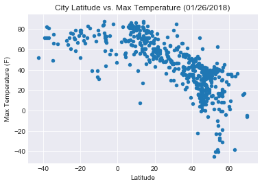
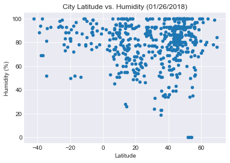
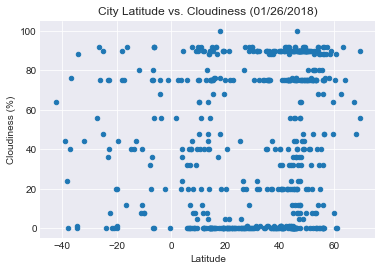
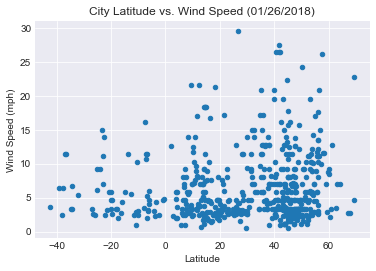

Observable Trends
1. In comparing the temperature vs. the latitude of the sample cities, it is observable that it is winter in the northern hemisphere as the latitudes to the north of the equator are showing lower maximum temperatures for the day. 

2. Cloudiness is fairly evenly distributed among different latitudes. 

3. Cities between the 20th and 60th degrees of latitude north of the equator show the largest variation in recorded humidity.


```python
import json
import random
import requests
import matplotlib.pyplot as plt
import pandas as pd
from citipy import citipy
import seaborn as sns
import numpy
import os
import datetime
```


```python
file_name = os.path.join("worldcities.csv")
city_pd = pd.read_csv(file_name)
```


```python
sample_cities = city_pd.sample(n=600)
```


```python
sample_cities['Temperature'] = ""
sample_cities['Humidity'] = ""
sample_cities['Cloudiness'] = ""
sample_cities['Wind Speed'] = ""
sample_cities.head()
```


<div>
<style>
    .dataframe thead tr:only-child th {
        text-align: right;
    }

    .dataframe thead th {
        text-align: left;
    }

    .dataframe tbody tr th {
        vertical-align: top;
    }
</style>
<table border="1" class="dataframe">
  <thead>
    <tr style="text-align: right;">
      <th></th>
      <th>Country</th>
      <th>City</th>
      <th>Latitude</th>
      <th>Longitude</th>
      <th>Temperature</th>
      <th>Humidity</th>
      <th>Cloudiness</th>
      <th>Wind Speed</th>
    </tr>
  </thead>
  <tbody>
    <tr>
      <th>31052</th>
      <td>pl</td>
      <td>bystrzyca klodzka</td>
      <td>50.298252</td>
      <td>16.653029</td>
      <td></td>
      <td></td>
      <td></td>
      <td></td>
    </tr>
    <tr>
      <th>28581</th>
      <td>ph</td>
      <td>lapuyan</td>
      <td>7.637900</td>
      <td>123.194400</td>
      <td></td>
      <td></td>
      <td></td>
      <td></td>
    </tr>
    <tr>
      <th>22410</th>
      <td>lt</td>
      <td>palanga</td>
      <td>55.917500</td>
      <td>21.068611</td>
      <td></td>
      <td></td>
      <td></td>
      <td></td>
    </tr>
    <tr>
      <th>34499</th>
      <td>ro</td>
      <td>tisau</td>
      <td>45.166667</td>
      <td>26.516667</td>
      <td></td>
      <td></td>
      <td></td>
      <td></td>
    </tr>
    <tr>
      <th>5880</th>
      <td>cn</td>
      <td>chengzihe</td>
      <td>45.333333</td>
      <td>131.066667</td>
      <td></td>
      <td></td>
      <td></td>
      <td></td>
    </tr>
  </tbody>
</table>
</div>


```python
file_name = "/Users/acollier/Documents/api_keys.json"
data = json.load(open(file_name))
gkey = data['open_weather_api_key']
units= "imperial"
```


```python
counter = 0
skip_count = 0

for index, row in sample_cities.iterrows():
    target_city = str(row['City'])
     
    url = "http://api.openweathermap.org/data/2.5/weather?"
    target_url = url + "appid=" + gkey + "&q=" + target_city + "&units=" + units
    cities_weather = requests.get(target_url).json()

    try:
        sample_cities.set_value(index, "Temperature", cities_weather["main"]["temp"])
        sample_cities.set_value(index, "Humidity", cities_weather["main"]["humidity"])
        sample_cities.set_value(index, "Cloudiness", cities_weather["clouds"]["all"])
        sample_cities.set_value(index, "Wind Speed", cities_weather["wind"]["speed"])
        counter = counter + 1
        print("City Number: " + str(counter) + " City: " + target_city + " " + target_url)
    
    except:
        skip_count += 1
        print("Skip Number: " + str(skip_count) + "City: " + target_city + " Missing field... skipping.")

```

    City Number: 1 City: bystrzyca klodzka http://api.openweathermap.org/data/2.5/weather?appid=25bc90a1196e6f153eece0bc0b0fc9eb&q=bystrzyca klodzka&units=imperial
    City Number: 2 City: lapuyan http://api.openweathermap.org/data/2.5/weather?appid=25bc90a1196e6f153eece0bc0b0fc9eb&q=lapuyan&units=imperial
    City Number: 3 City: palanga http://api.openweathermap.org/data/2.5/weather?appid=25bc90a1196e6f153eece0bc0b0fc9eb&q=palanga&units=imperial
    City Number: 4 City: tisau http://api.openweathermap.org/data/2.5/weather?appid=25bc90a1196e6f153eece0bc0b0fc9eb&q=tisau&units=imperial
    City Number: 5 City: chengzihe http://api.openweathermap.org/data/2.5/weather?appid=25bc90a1196e6f153eece0bc0b0fc9eb&q=chengzihe&units=imperial
    City Number: 6 City: krabi http://api.openweathermap.org/data/2.5/weather?appid=25bc90a1196e6f153eece0bc0b0fc9eb&q=krabi&units=imperial
    City Number: 7 City: gola bazar http://api.openweathermap.org/data/2.5/weather?appid=25bc90a1196e6f153eece0bc0b0fc9eb&q=gola bazar&units=imperial
    City Number: 8 City: la masica http://api.openweathermap.org/data/2.5/weather?appid=25bc90a1196e6f153eece0bc0b0fc9eb&q=la masica&units=imperial
    City Number: 9 City: plzen http://api.openweathermap.org/data/2.5/weather?appid=25bc90a1196e6f153eece0bc0b0fc9eb&q=plzen&units=imperial
    City Number: 10 City: magura ilvei http://api.openweathermap.org/data/2.5/weather?appid=25bc90a1196e6f153eece0bc0b0fc9eb&q=magura ilvei&units=imperial
    Skip Number: 1City: kipseli Missing field... skipping.
    City Number: 11 City: ruffano http://api.openweathermap.org/data/2.5/weather?appid=25bc90a1196e6f153eece0bc0b0fc9eb&q=ruffano&units=imperial
    City Number: 12 City: sidhpura http://api.openweathermap.org/data/2.5/weather?appid=25bc90a1196e6f153eece0bc0b0fc9eb&q=sidhpura&units=imperial
    City Number: 13 City: pegnitz http://api.openweathermap.org/data/2.5/weather?appid=25bc90a1196e6f153eece0bc0b0fc9eb&q=pegnitz&units=imperial
    City Number: 14 City: mont-joli http://api.openweathermap.org/data/2.5/weather?appid=25bc90a1196e6f153eece0bc0b0fc9eb&q=mont-joli&units=imperial
    City Number: 15 City: rondonopolis http://api.openweathermap.org/data/2.5/weather?appid=25bc90a1196e6f153eece0bc0b0fc9eb&q=rondonopolis&units=imperial
    City Number: 16 City: gulaothi http://api.openweathermap.org/data/2.5/weather?appid=25bc90a1196e6f153eece0bc0b0fc9eb&q=gulaothi&units=imperial
    City Number: 17 City: marsaxlokk http://api.openweathermap.org/data/2.5/weather?appid=25bc90a1196e6f153eece0bc0b0fc9eb&q=marsaxlokk&units=imperial
    City Number: 18 City: lexington-fayette http://api.openweathermap.org/data/2.5/weather?appid=25bc90a1196e6f153eece0bc0b0fc9eb&q=lexington-fayette&units=imperial
    City Number: 19 City: steubenville http://api.openweathermap.org/data/2.5/weather?appid=25bc90a1196e6f153eece0bc0b0fc9eb&q=steubenville&units=imperial
    City Number: 20 City: yarkovo http://api.openweathermap.org/data/2.5/weather?appid=25bc90a1196e6f153eece0bc0b0fc9eb&q=yarkovo&units=imperial
    City Number: 21 City: bulqize http://api.openweathermap.org/data/2.5/weather?appid=25bc90a1196e6f153eece0bc0b0fc9eb&q=bulqize&units=imperial
    City Number: 22 City: harsum http://api.openweathermap.org/data/2.5/weather?appid=25bc90a1196e6f153eece0bc0b0fc9eb&q=harsum&units=imperial
    City Number: 23 City: taga http://api.openweathermap.org/data/2.5/weather?appid=25bc90a1196e6f153eece0bc0b0fc9eb&q=taga&units=imperial
    City Number: 24 City: moses lake http://api.openweathermap.org/data/2.5/weather?appid=25bc90a1196e6f153eece0bc0b0fc9eb&q=moses lake&units=imperial
    City Number: 25 City: malaiba http://api.openweathermap.org/data/2.5/weather?appid=25bc90a1196e6f153eece0bc0b0fc9eb&q=malaiba&units=imperial
    City Number: 26 City: kyzyl http://api.openweathermap.org/data/2.5/weather?appid=25bc90a1196e6f153eece0bc0b0fc9eb&q=kyzyl&units=imperial
    City Number: 27 City: le portel http://api.openweathermap.org/data/2.5/weather?appid=25bc90a1196e6f153eece0bc0b0fc9eb&q=le portel&units=imperial
    City Number: 28 City: portland http://api.openweathermap.org/data/2.5/weather?appid=25bc90a1196e6f153eece0bc0b0fc9eb&q=portland&units=imperial
    City Number: 29 City: bilsanda http://api.openweathermap.org/data/2.5/weather?appid=25bc90a1196e6f153eece0bc0b0fc9eb&q=bilsanda&units=imperial
    City Number: 30 City: santiago http://api.openweathermap.org/data/2.5/weather?appid=25bc90a1196e6f153eece0bc0b0fc9eb&q=santiago&units=imperial
    City Number: 31 City: batatais http://api.openweathermap.org/data/2.5/weather?appid=25bc90a1196e6f153eece0bc0b0fc9eb&q=batatais&units=imperial
    City Number: 32 City: floresti http://api.openweathermap.org/data/2.5/weather?appid=25bc90a1196e6f153eece0bc0b0fc9eb&q=floresti&units=imperial
    City Number: 33 City: monsummano terme http://api.openweathermap.org/data/2.5/weather?appid=25bc90a1196e6f153eece0bc0b0fc9eb&q=monsummano terme&units=imperial
    City Number: 34 City: oberasbach http://api.openweathermap.org/data/2.5/weather?appid=25bc90a1196e6f153eece0bc0b0fc9eb&q=oberasbach&units=imperial
    City Number: 35 City: povarovo http://api.openweathermap.org/data/2.5/weather?appid=25bc90a1196e6f153eece0bc0b0fc9eb&q=povarovo&units=imperial
    City Number: 36 City: elias http://api.openweathermap.org/data/2.5/weather?appid=25bc90a1196e6f153eece0bc0b0fc9eb&q=elias&units=imperial
    Skip Number: 2City: angelokhorion Missing field... skipping.
    City Number: 37 City: hundested http://api.openweathermap.org/data/2.5/weather?appid=25bc90a1196e6f153eece0bc0b0fc9eb&q=hundested&units=imperial
    City Number: 38 City: vraca http://api.openweathermap.org/data/2.5/weather?appid=25bc90a1196e6f153eece0bc0b0fc9eb&q=vraca&units=imperial
    City Number: 39 City: ono http://api.openweathermap.org/data/2.5/weather?appid=25bc90a1196e6f153eece0bc0b0fc9eb&q=ono&units=imperial
    City Number: 40 City: stara ves nad ondrejnici http://api.openweathermap.org/data/2.5/weather?appid=25bc90a1196e6f153eece0bc0b0fc9eb&q=stara ves nad ondrejnici&units=imperial
    City Number: 41 City: sherbakul http://api.openweathermap.org/data/2.5/weather?appid=25bc90a1196e6f153eece0bc0b0fc9eb&q=sherbakul&units=imperial
    City Number: 42 City: wolfen http://api.openweathermap.org/data/2.5/weather?appid=25bc90a1196e6f153eece0bc0b0fc9eb&q=wolfen&units=imperial
    Skip Number: 3City: novotalitsy Missing field... skipping.
    City Number: 43 City: mahbubabad http://api.openweathermap.org/data/2.5/weather?appid=25bc90a1196e6f153eece0bc0b0fc9eb&q=mahbubabad&units=imperial
    City Number: 44 City: ambagarh chauki http://api.openweathermap.org/data/2.5/weather?appid=25bc90a1196e6f153eece0bc0b0fc9eb&q=ambagarh chauki&units=imperial
    City Number: 45 City: salcedo http://api.openweathermap.org/data/2.5/weather?appid=25bc90a1196e6f153eece0bc0b0fc9eb&q=salcedo&units=imperial
    City Number: 46 City: zhitnevo http://api.openweathermap.org/data/2.5/weather?appid=25bc90a1196e6f153eece0bc0b0fc9eb&q=zhitnevo&units=imperial
    City Number: 47 City: picton http://api.openweathermap.org/data/2.5/weather?appid=25bc90a1196e6f153eece0bc0b0fc9eb&q=picton&units=imperial
    City Number: 48 City: nor gyukh http://api.openweathermap.org/data/2.5/weather?appid=25bc90a1196e6f153eece0bc0b0fc9eb&q=nor gyukh&units=imperial
    City Number: 49 City: weru http://api.openweathermap.org/data/2.5/weather?appid=25bc90a1196e6f153eece0bc0b0fc9eb&q=weru&units=imperial
    City Number: 50 City: verkhnebakanskiy http://api.openweathermap.org/data/2.5/weather?appid=25bc90a1196e6f153eece0bc0b0fc9eb&q=verkhnebakanskiy&units=imperial
    City Number: 51 City: zacatepec http://api.openweathermap.org/data/2.5/weather?appid=25bc90a1196e6f153eece0bc0b0fc9eb&q=zacatepec&units=imperial
    City Number: 52 City: poggibonsi http://api.openweathermap.org/data/2.5/weather?appid=25bc90a1196e6f153eece0bc0b0fc9eb&q=poggibonsi&units=imperial
    City Number: 53 City: el carmen http://api.openweathermap.org/data/2.5/weather?appid=25bc90a1196e6f153eece0bc0b0fc9eb&q=el carmen&units=imperial
    City Number: 54 City: guinayangan http://api.openweathermap.org/data/2.5/weather?appid=25bc90a1196e6f153eece0bc0b0fc9eb&q=guinayangan&units=imperial
    City Number: 55 City: hoyanger http://api.openweathermap.org/data/2.5/weather?appid=25bc90a1196e6f153eece0bc0b0fc9eb&q=hoyanger&units=imperial
    City Number: 56 City: fatick http://api.openweathermap.org/data/2.5/weather?appid=25bc90a1196e6f153eece0bc0b0fc9eb&q=fatick&units=imperial
    City Number: 57 City: noboribetsu http://api.openweathermap.org/data/2.5/weather?appid=25bc90a1196e6f153eece0bc0b0fc9eb&q=noboribetsu&units=imperial
    City Number: 58 City: kraslava http://api.openweathermap.org/data/2.5/weather?appid=25bc90a1196e6f153eece0bc0b0fc9eb&q=kraslava&units=imperial
    City Number: 59 City: preili http://api.openweathermap.org/data/2.5/weather?appid=25bc90a1196e6f153eece0bc0b0fc9eb&q=preili&units=imperial
    City Number: 60 City: kadoma http://api.openweathermap.org/data/2.5/weather?appid=25bc90a1196e6f153eece0bc0b0fc9eb&q=kadoma&units=imperial
    City Number: 61 City: vaideeni http://api.openweathermap.org/data/2.5/weather?appid=25bc90a1196e6f153eece0bc0b0fc9eb&q=vaideeni&units=imperial
    City Number: 62 City: bergneustadt http://api.openweathermap.org/data/2.5/weather?appid=25bc90a1196e6f153eece0bc0b0fc9eb&q=bergneustadt&units=imperial
    City Number: 63 City: sauca http://api.openweathermap.org/data/2.5/weather?appid=25bc90a1196e6f153eece0bc0b0fc9eb&q=sauca&units=imperial
    City Number: 64 City: maslovare http://api.openweathermap.org/data/2.5/weather?appid=25bc90a1196e6f153eece0bc0b0fc9eb&q=maslovare&units=imperial
    City Number: 65 City: alaca http://api.openweathermap.org/data/2.5/weather?appid=25bc90a1196e6f153eece0bc0b0fc9eb&q=alaca&units=imperial
    City Number: 66 City: cuza voda http://api.openweathermap.org/data/2.5/weather?appid=25bc90a1196e6f153eece0bc0b0fc9eb&q=cuza voda&units=imperial
    City Number: 67 City: san antonio http://api.openweathermap.org/data/2.5/weather?appid=25bc90a1196e6f153eece0bc0b0fc9eb&q=san antonio&units=imperial
    City Number: 68 City: itatinga http://api.openweathermap.org/data/2.5/weather?appid=25bc90a1196e6f153eece0bc0b0fc9eb&q=itatinga&units=imperial
    City Number: 69 City: derbent http://api.openweathermap.org/data/2.5/weather?appid=25bc90a1196e6f153eece0bc0b0fc9eb&q=derbent&units=imperial
    City Number: 70 City: palanca http://api.openweathermap.org/data/2.5/weather?appid=25bc90a1196e6f153eece0bc0b0fc9eb&q=palanca&units=imperial
    City Number: 71 City: nova lima http://api.openweathermap.org/data/2.5/weather?appid=25bc90a1196e6f153eece0bc0b0fc9eb&q=nova lima&units=imperial
    City Number: 72 City: dilla http://api.openweathermap.org/data/2.5/weather?appid=25bc90a1196e6f153eece0bc0b0fc9eb&q=dilla&units=imperial
    City Number: 73 City: ilirska bistrica http://api.openweathermap.org/data/2.5/weather?appid=25bc90a1196e6f153eece0bc0b0fc9eb&q=ilirska bistrica&units=imperial
    City Number: 74 City: ayia paraskevi http://api.openweathermap.org/data/2.5/weather?appid=25bc90a1196e6f153eece0bc0b0fc9eb&q=ayia paraskevi&units=imperial
    City Number: 75 City: san antonio suchitepequez http://api.openweathermap.org/data/2.5/weather?appid=25bc90a1196e6f153eece0bc0b0fc9eb&q=san antonio suchitepequez&units=imperial
    City Number: 76 City: kankipadu http://api.openweathermap.org/data/2.5/weather?appid=25bc90a1196e6f153eece0bc0b0fc9eb&q=kankipadu&units=imperial
    City Number: 77 City: lakatoro http://api.openweathermap.org/data/2.5/weather?appid=25bc90a1196e6f153eece0bc0b0fc9eb&q=lakatoro&units=imperial
    City Number: 78 City: steinsel http://api.openweathermap.org/data/2.5/weather?appid=25bc90a1196e6f153eece0bc0b0fc9eb&q=steinsel&units=imperial
    City Number: 79 City: brunssum http://api.openweathermap.org/data/2.5/weather?appid=25bc90a1196e6f153eece0bc0b0fc9eb&q=brunssum&units=imperial
    City Number: 80 City: prochnookopskaya http://api.openweathermap.org/data/2.5/weather?appid=25bc90a1196e6f153eece0bc0b0fc9eb&q=prochnookopskaya&units=imperial
    City Number: 81 City: maribojoc http://api.openweathermap.org/data/2.5/weather?appid=25bc90a1196e6f153eece0bc0b0fc9eb&q=maribojoc&units=imperial
    City Number: 82 City: alpignano http://api.openweathermap.org/data/2.5/weather?appid=25bc90a1196e6f153eece0bc0b0fc9eb&q=alpignano&units=imperial
    City Number: 83 City: tafo http://api.openweathermap.org/data/2.5/weather?appid=25bc90a1196e6f153eece0bc0b0fc9eb&q=tafo&units=imperial
    City Number: 84 City: nkhata bay http://api.openweathermap.org/data/2.5/weather?appid=25bc90a1196e6f153eece0bc0b0fc9eb&q=nkhata bay&units=imperial
    City Number: 85 City: kodinar http://api.openweathermap.org/data/2.5/weather?appid=25bc90a1196e6f153eece0bc0b0fc9eb&q=kodinar&units=imperial
    Skip Number: 4City: tabulbah Missing field... skipping.
    City Number: 86 City: russellville http://api.openweathermap.org/data/2.5/weather?appid=25bc90a1196e6f153eece0bc0b0fc9eb&q=russellville&units=imperial
    City Number: 87 City: jabalpur http://api.openweathermap.org/data/2.5/weather?appid=25bc90a1196e6f153eece0bc0b0fc9eb&q=jabalpur&units=imperial
    City Number: 88 City: hirakud http://api.openweathermap.org/data/2.5/weather?appid=25bc90a1196e6f153eece0bc0b0fc9eb&q=hirakud&units=imperial
    City Number: 89 City: bilimora http://api.openweathermap.org/data/2.5/weather?appid=25bc90a1196e6f153eece0bc0b0fc9eb&q=bilimora&units=imperial
    City Number: 90 City: hradec kralove http://api.openweathermap.org/data/2.5/weather?appid=25bc90a1196e6f153eece0bc0b0fc9eb&q=hradec kralove&units=imperial
    City Number: 91 City: chestermere http://api.openweathermap.org/data/2.5/weather?appid=25bc90a1196e6f153eece0bc0b0fc9eb&q=chestermere&units=imperial
    City Number: 92 City: msida http://api.openweathermap.org/data/2.5/weather?appid=25bc90a1196e6f153eece0bc0b0fc9eb&q=msida&units=imperial
    City Number: 93 City: akim swedru http://api.openweathermap.org/data/2.5/weather?appid=25bc90a1196e6f153eece0bc0b0fc9eb&q=akim swedru&units=imperial
    City Number: 94 City: jerusalem http://api.openweathermap.org/data/2.5/weather?appid=25bc90a1196e6f153eece0bc0b0fc9eb&q=jerusalem&units=imperial
    City Number: 95 City: tatarbunary http://api.openweathermap.org/data/2.5/weather?appid=25bc90a1196e6f153eece0bc0b0fc9eb&q=tatarbunary&units=imperial
    City Number: 96 City: bebington http://api.openweathermap.org/data/2.5/weather?appid=25bc90a1196e6f153eece0bc0b0fc9eb&q=bebington&units=imperial
    City Number: 97 City: reni http://api.openweathermap.org/data/2.5/weather?appid=25bc90a1196e6f153eece0bc0b0fc9eb&q=reni&units=imperial
    City Number: 98 City: kuala pilah http://api.openweathermap.org/data/2.5/weather?appid=25bc90a1196e6f153eece0bc0b0fc9eb&q=kuala pilah&units=imperial
    City Number: 99 City: islip http://api.openweathermap.org/data/2.5/weather?appid=25bc90a1196e6f153eece0bc0b0fc9eb&q=islip&units=imperial
    City Number: 100 City: beasain http://api.openweathermap.org/data/2.5/weather?appid=25bc90a1196e6f153eece0bc0b0fc9eb&q=beasain&units=imperial
    City Number: 101 City: starobaltachevo http://api.openweathermap.org/data/2.5/weather?appid=25bc90a1196e6f153eece0bc0b0fc9eb&q=starobaltachevo&units=imperial
    City Number: 102 City: widnes http://api.openweathermap.org/data/2.5/weather?appid=25bc90a1196e6f153eece0bc0b0fc9eb&q=widnes&units=imperial
    City Number: 103 City: waynesboro http://api.openweathermap.org/data/2.5/weather?appid=25bc90a1196e6f153eece0bc0b0fc9eb&q=waynesboro&units=imperial
    Skip Number: 5City: marasesti Missing field... skipping.
    City Number: 104 City: jaszszentandras http://api.openweathermap.org/data/2.5/weather?appid=25bc90a1196e6f153eece0bc0b0fc9eb&q=jaszszentandras&units=imperial
    City Number: 105 City: acambaro http://api.openweathermap.org/data/2.5/weather?appid=25bc90a1196e6f153eece0bc0b0fc9eb&q=acambaro&units=imperial
    City Number: 106 City: hondagua http://api.openweathermap.org/data/2.5/weather?appid=25bc90a1196e6f153eece0bc0b0fc9eb&q=hondagua&units=imperial
    City Number: 107 City: magdagachi http://api.openweathermap.org/data/2.5/weather?appid=25bc90a1196e6f153eece0bc0b0fc9eb&q=magdagachi&units=imperial
    City Number: 108 City: aulnoye-aymeries http://api.openweathermap.org/data/2.5/weather?appid=25bc90a1196e6f153eece0bc0b0fc9eb&q=aulnoye-aymeries&units=imperial
    City Number: 109 City: banjar http://api.openweathermap.org/data/2.5/weather?appid=25bc90a1196e6f153eece0bc0b0fc9eb&q=banjar&units=imperial
    City Number: 110 City: long http://api.openweathermap.org/data/2.5/weather?appid=25bc90a1196e6f153eece0bc0b0fc9eb&q=long&units=imperial
    City Number: 111 City: magole http://api.openweathermap.org/data/2.5/weather?appid=25bc90a1196e6f153eece0bc0b0fc9eb&q=magole&units=imperial
    City Number: 112 City: washington http://api.openweathermap.org/data/2.5/weather?appid=25bc90a1196e6f153eece0bc0b0fc9eb&q=washington&units=imperial
    City Number: 113 City: cahul http://api.openweathermap.org/data/2.5/weather?appid=25bc90a1196e6f153eece0bc0b0fc9eb&q=cahul&units=imperial
    City Number: 114 City: jorasti http://api.openweathermap.org/data/2.5/weather?appid=25bc90a1196e6f153eece0bc0b0fc9eb&q=jorasti&units=imperial
    City Number: 115 City: framingham http://api.openweathermap.org/data/2.5/weather?appid=25bc90a1196e6f153eece0bc0b0fc9eb&q=framingham&units=imperial
    City Number: 116 City: krasnoyarskaya http://api.openweathermap.org/data/2.5/weather?appid=25bc90a1196e6f153eece0bc0b0fc9eb&q=krasnoyarskaya&units=imperial
    City Number: 117 City: san vicente http://api.openweathermap.org/data/2.5/weather?appid=25bc90a1196e6f153eece0bc0b0fc9eb&q=san vicente&units=imperial
    City Number: 118 City: tacna http://api.openweathermap.org/data/2.5/weather?appid=25bc90a1196e6f153eece0bc0b0fc9eb&q=tacna&units=imperial
    City Number: 119 City: santoshpur http://api.openweathermap.org/data/2.5/weather?appid=25bc90a1196e6f153eece0bc0b0fc9eb&q=santoshpur&units=imperial
    City Number: 120 City: komyshuvakha http://api.openweathermap.org/data/2.5/weather?appid=25bc90a1196e6f153eece0bc0b0fc9eb&q=komyshuvakha&units=imperial
    Skip Number: 6City: jamabalud Missing field... skipping.
    City Number: 121 City: inangatan http://api.openweathermap.org/data/2.5/weather?appid=25bc90a1196e6f153eece0bc0b0fc9eb&q=inangatan&units=imperial
    City Number: 122 City: ixhuatan http://api.openweathermap.org/data/2.5/weather?appid=25bc90a1196e6f153eece0bc0b0fc9eb&q=ixhuatan&units=imperial
    City Number: 123 City: wuustwezel http://api.openweathermap.org/data/2.5/weather?appid=25bc90a1196e6f153eece0bc0b0fc9eb&q=wuustwezel&units=imperial
    City Number: 124 City: honggang http://api.openweathermap.org/data/2.5/weather?appid=25bc90a1196e6f153eece0bc0b0fc9eb&q=honggang&units=imperial
    City Number: 125 City: essenbach http://api.openweathermap.org/data/2.5/weather?appid=25bc90a1196e6f153eece0bc0b0fc9eb&q=essenbach&units=imperial
    City Number: 126 City: terrugem http://api.openweathermap.org/data/2.5/weather?appid=25bc90a1196e6f153eece0bc0b0fc9eb&q=terrugem&units=imperial
    Skip Number: 7City: djang Missing field... skipping.
    City Number: 127 City: bocanda http://api.openweathermap.org/data/2.5/weather?appid=25bc90a1196e6f153eece0bc0b0fc9eb&q=bocanda&units=imperial
    City Number: 128 City: uusikaupunki http://api.openweathermap.org/data/2.5/weather?appid=25bc90a1196e6f153eece0bc0b0fc9eb&q=uusikaupunki&units=imperial
    City Number: 129 City: khanna http://api.openweathermap.org/data/2.5/weather?appid=25bc90a1196e6f153eece0bc0b0fc9eb&q=khanna&units=imperial
    City Number: 130 City: tsalenjikha http://api.openweathermap.org/data/2.5/weather?appid=25bc90a1196e6f153eece0bc0b0fc9eb&q=tsalenjikha&units=imperial
    City Number: 131 City: bhigvan http://api.openweathermap.org/data/2.5/weather?appid=25bc90a1196e6f153eece0bc0b0fc9eb&q=bhigvan&units=imperial
    City Number: 132 City: san guillermo http://api.openweathermap.org/data/2.5/weather?appid=25bc90a1196e6f153eece0bc0b0fc9eb&q=san guillermo&units=imperial
    City Number: 133 City: khandyga http://api.openweathermap.org/data/2.5/weather?appid=25bc90a1196e6f153eece0bc0b0fc9eb&q=khandyga&units=imperial
    City Number: 134 City: boscoreale http://api.openweathermap.org/data/2.5/weather?appid=25bc90a1196e6f153eece0bc0b0fc9eb&q=boscoreale&units=imperial
    City Number: 135 City: wenatchee http://api.openweathermap.org/data/2.5/weather?appid=25bc90a1196e6f153eece0bc0b0fc9eb&q=wenatchee&units=imperial
    City Number: 136 City: cerquilho http://api.openweathermap.org/data/2.5/weather?appid=25bc90a1196e6f153eece0bc0b0fc9eb&q=cerquilho&units=imperial
    City Number: 137 City: kurilsk http://api.openweathermap.org/data/2.5/weather?appid=25bc90a1196e6f153eece0bc0b0fc9eb&q=kurilsk&units=imperial
    City Number: 138 City: myjava http://api.openweathermap.org/data/2.5/weather?appid=25bc90a1196e6f153eece0bc0b0fc9eb&q=myjava&units=imperial
    City Number: 139 City: dobarlau http://api.openweathermap.org/data/2.5/weather?appid=25bc90a1196e6f153eece0bc0b0fc9eb&q=dobarlau&units=imperial
    City Number: 140 City: rio tercero http://api.openweathermap.org/data/2.5/weather?appid=25bc90a1196e6f153eece0bc0b0fc9eb&q=rio tercero&units=imperial
    City Number: 141 City: kerewan http://api.openweathermap.org/data/2.5/weather?appid=25bc90a1196e6f153eece0bc0b0fc9eb&q=kerewan&units=imperial
    City Number: 142 City: kani http://api.openweathermap.org/data/2.5/weather?appid=25bc90a1196e6f153eece0bc0b0fc9eb&q=kani&units=imperial
    City Number: 143 City: ramganj mandi http://api.openweathermap.org/data/2.5/weather?appid=25bc90a1196e6f153eece0bc0b0fc9eb&q=ramganj mandi&units=imperial
    City Number: 144 City: serra http://api.openweathermap.org/data/2.5/weather?appid=25bc90a1196e6f153eece0bc0b0fc9eb&q=serra&units=imperial
    City Number: 145 City: sallins http://api.openweathermap.org/data/2.5/weather?appid=25bc90a1196e6f153eece0bc0b0fc9eb&q=sallins&units=imperial
    City Number: 146 City: apex http://api.openweathermap.org/data/2.5/weather?appid=25bc90a1196e6f153eece0bc0b0fc9eb&q=apex&units=imperial
    City Number: 147 City: sagar http://api.openweathermap.org/data/2.5/weather?appid=25bc90a1196e6f153eece0bc0b0fc9eb&q=sagar&units=imperial
    City Number: 148 City: bad bevensen http://api.openweathermap.org/data/2.5/weather?appid=25bc90a1196e6f153eece0bc0b0fc9eb&q=bad bevensen&units=imperial
    City Number: 149 City: chikitigarh http://api.openweathermap.org/data/2.5/weather?appid=25bc90a1196e6f153eece0bc0b0fc9eb&q=chikitigarh&units=imperial
    City Number: 150 City: san pedro sacatepequez http://api.openweathermap.org/data/2.5/weather?appid=25bc90a1196e6f153eece0bc0b0fc9eb&q=san pedro sacatepequez&units=imperial
    City Number: 151 City: lovozero http://api.openweathermap.org/data/2.5/weather?appid=25bc90a1196e6f153eece0bc0b0fc9eb&q=lovozero&units=imperial
    City Number: 152 City: shablykino http://api.openweathermap.org/data/2.5/weather?appid=25bc90a1196e6f153eece0bc0b0fc9eb&q=shablykino&units=imperial
    City Number: 153 City: oak lawn http://api.openweathermap.org/data/2.5/weather?appid=25bc90a1196e6f153eece0bc0b0fc9eb&q=oak lawn&units=imperial
    City Number: 154 City: yazykovo http://api.openweathermap.org/data/2.5/weather?appid=25bc90a1196e6f153eece0bc0b0fc9eb&q=yazykovo&units=imperial
    City Number: 155 City: lebanon http://api.openweathermap.org/data/2.5/weather?appid=25bc90a1196e6f153eece0bc0b0fc9eb&q=lebanon&units=imperial
    City Number: 156 City: lagoa nova http://api.openweathermap.org/data/2.5/weather?appid=25bc90a1196e6f153eece0bc0b0fc9eb&q=lagoa nova&units=imperial
    City Number: 157 City: zavoaia http://api.openweathermap.org/data/2.5/weather?appid=25bc90a1196e6f153eece0bc0b0fc9eb&q=zavoaia&units=imperial
    City Number: 158 City: senhora da hora http://api.openweathermap.org/data/2.5/weather?appid=25bc90a1196e6f153eece0bc0b0fc9eb&q=senhora da hora&units=imperial
    City Number: 159 City: ajacuba http://api.openweathermap.org/data/2.5/weather?appid=25bc90a1196e6f153eece0bc0b0fc9eb&q=ajacuba&units=imperial
    City Number: 160 City: niiza http://api.openweathermap.org/data/2.5/weather?appid=25bc90a1196e6f153eece0bc0b0fc9eb&q=niiza&units=imperial
    City Number: 161 City: uklana mandi http://api.openweathermap.org/data/2.5/weather?appid=25bc90a1196e6f153eece0bc0b0fc9eb&q=uklana mandi&units=imperial
    City Number: 162 City: grammatikou http://api.openweathermap.org/data/2.5/weather?appid=25bc90a1196e6f153eece0bc0b0fc9eb&q=grammatikou&units=imperial
    City Number: 163 City: memmingen http://api.openweathermap.org/data/2.5/weather?appid=25bc90a1196e6f153eece0bc0b0fc9eb&q=memmingen&units=imperial
    City Number: 164 City: lesnyye polyany http://api.openweathermap.org/data/2.5/weather?appid=25bc90a1196e6f153eece0bc0b0fc9eb&q=lesnyye polyany&units=imperial
    City Number: 165 City: talitay http://api.openweathermap.org/data/2.5/weather?appid=25bc90a1196e6f153eece0bc0b0fc9eb&q=talitay&units=imperial
    City Number: 166 City: kericho http://api.openweathermap.org/data/2.5/weather?appid=25bc90a1196e6f153eece0bc0b0fc9eb&q=kericho&units=imperial
    City Number: 167 City: gorbatovka http://api.openweathermap.org/data/2.5/weather?appid=25bc90a1196e6f153eece0bc0b0fc9eb&q=gorbatovka&units=imperial
    City Number: 168 City: berja http://api.openweathermap.org/data/2.5/weather?appid=25bc90a1196e6f153eece0bc0b0fc9eb&q=berja&units=imperial
    City Number: 169 City: dzemul http://api.openweathermap.org/data/2.5/weather?appid=25bc90a1196e6f153eece0bc0b0fc9eb&q=dzemul&units=imperial
    City Number: 170 City: santa cecilia http://api.openweathermap.org/data/2.5/weather?appid=25bc90a1196e6f153eece0bc0b0fc9eb&q=santa cecilia&units=imperial
    City Number: 171 City: gratkorn http://api.openweathermap.org/data/2.5/weather?appid=25bc90a1196e6f153eece0bc0b0fc9eb&q=gratkorn&units=imperial
    City Number: 172 City: grenville http://api.openweathermap.org/data/2.5/weather?appid=25bc90a1196e6f153eece0bc0b0fc9eb&q=grenville&units=imperial
    City Number: 173 City: haines city http://api.openweathermap.org/data/2.5/weather?appid=25bc90a1196e6f153eece0bc0b0fc9eb&q=haines city&units=imperial
    City Number: 174 City: srostki http://api.openweathermap.org/data/2.5/weather?appid=25bc90a1196e6f153eece0bc0b0fc9eb&q=srostki&units=imperial
    City Number: 175 City: illzach http://api.openweathermap.org/data/2.5/weather?appid=25bc90a1196e6f153eece0bc0b0fc9eb&q=illzach&units=imperial
    City Number: 176 City: invermere http://api.openweathermap.org/data/2.5/weather?appid=25bc90a1196e6f153eece0bc0b0fc9eb&q=invermere&units=imperial
    City Number: 177 City: sarabia http://api.openweathermap.org/data/2.5/weather?appid=25bc90a1196e6f153eece0bc0b0fc9eb&q=sarabia&units=imperial
    City Number: 178 City: lokomotivnyy http://api.openweathermap.org/data/2.5/weather?appid=25bc90a1196e6f153eece0bc0b0fc9eb&q=lokomotivnyy&units=imperial
    City Number: 179 City: innoshima http://api.openweathermap.org/data/2.5/weather?appid=25bc90a1196e6f153eece0bc0b0fc9eb&q=innoshima&units=imperial
    City Number: 180 City: esso http://api.openweathermap.org/data/2.5/weather?appid=25bc90a1196e6f153eece0bc0b0fc9eb&q=esso&units=imperial
    City Number: 181 City: vijes http://api.openweathermap.org/data/2.5/weather?appid=25bc90a1196e6f153eece0bc0b0fc9eb&q=vijes&units=imperial
    City Number: 182 City: castro http://api.openweathermap.org/data/2.5/weather?appid=25bc90a1196e6f153eece0bc0b0fc9eb&q=castro&units=imperial
    City Number: 183 City: kuragino http://api.openweathermap.org/data/2.5/weather?appid=25bc90a1196e6f153eece0bc0b0fc9eb&q=kuragino&units=imperial
    City Number: 184 City: minamiashigara http://api.openweathermap.org/data/2.5/weather?appid=25bc90a1196e6f153eece0bc0b0fc9eb&q=minamiashigara&units=imperial
    City Number: 185 City: new london http://api.openweathermap.org/data/2.5/weather?appid=25bc90a1196e6f153eece0bc0b0fc9eb&q=new london&units=imperial
    City Number: 186 City: trzebiatow http://api.openweathermap.org/data/2.5/weather?appid=25bc90a1196e6f153eece0bc0b0fc9eb&q=trzebiatow&units=imperial
    City Number: 187 City: sostanj http://api.openweathermap.org/data/2.5/weather?appid=25bc90a1196e6f153eece0bc0b0fc9eb&q=sostanj&units=imperial
    City Number: 188 City: balanesti http://api.openweathermap.org/data/2.5/weather?appid=25bc90a1196e6f153eece0bc0b0fc9eb&q=balanesti&units=imperial
    City Number: 189 City: cedros http://api.openweathermap.org/data/2.5/weather?appid=25bc90a1196e6f153eece0bc0b0fc9eb&q=cedros&units=imperial
    City Number: 190 City: san fernando http://api.openweathermap.org/data/2.5/weather?appid=25bc90a1196e6f153eece0bc0b0fc9eb&q=san fernando&units=imperial
    City Number: 191 City: erie http://api.openweathermap.org/data/2.5/weather?appid=25bc90a1196e6f153eece0bc0b0fc9eb&q=erie&units=imperial
    City Number: 192 City: tayirove http://api.openweathermap.org/data/2.5/weather?appid=25bc90a1196e6f153eece0bc0b0fc9eb&q=tayirove&units=imperial
    City Number: 193 City: babat http://api.openweathermap.org/data/2.5/weather?appid=25bc90a1196e6f153eece0bc0b0fc9eb&q=babat&units=imperial
    City Number: 194 City: susanville http://api.openweathermap.org/data/2.5/weather?appid=25bc90a1196e6f153eece0bc0b0fc9eb&q=susanville&units=imperial
    City Number: 195 City: bezons http://api.openweathermap.org/data/2.5/weather?appid=25bc90a1196e6f153eece0bc0b0fc9eb&q=bezons&units=imperial
    City Number: 196 City: husum http://api.openweathermap.org/data/2.5/weather?appid=25bc90a1196e6f153eece0bc0b0fc9eb&q=husum&units=imperial
    City Number: 197 City: hluti http://api.openweathermap.org/data/2.5/weather?appid=25bc90a1196e6f153eece0bc0b0fc9eb&q=hluti&units=imperial
    City Number: 198 City: arkalgud http://api.openweathermap.org/data/2.5/weather?appid=25bc90a1196e6f153eece0bc0b0fc9eb&q=arkalgud&units=imperial
    City Number: 199 City: bailen http://api.openweathermap.org/data/2.5/weather?appid=25bc90a1196e6f153eece0bc0b0fc9eb&q=bailen&units=imperial
    City Number: 200 City: alcala la real http://api.openweathermap.org/data/2.5/weather?appid=25bc90a1196e6f153eece0bc0b0fc9eb&q=alcala la real&units=imperial
    City Number: 201 City: el chol http://api.openweathermap.org/data/2.5/weather?appid=25bc90a1196e6f153eece0bc0b0fc9eb&q=el chol&units=imperial
    City Number: 202 City: mehndawal http://api.openweathermap.org/data/2.5/weather?appid=25bc90a1196e6f153eece0bc0b0fc9eb&q=mehndawal&units=imperial
    City Number: 203 City: dronfield http://api.openweathermap.org/data/2.5/weather?appid=25bc90a1196e6f153eece0bc0b0fc9eb&q=dronfield&units=imperial
    City Number: 204 City: skjold http://api.openweathermap.org/data/2.5/weather?appid=25bc90a1196e6f153eece0bc0b0fc9eb&q=skjold&units=imperial
    City Number: 205 City: cintalapa http://api.openweathermap.org/data/2.5/weather?appid=25bc90a1196e6f153eece0bc0b0fc9eb&q=cintalapa&units=imperial
    City Number: 206 City: cacimba de dentro http://api.openweathermap.org/data/2.5/weather?appid=25bc90a1196e6f153eece0bc0b0fc9eb&q=cacimba de dentro&units=imperial
    City Number: 207 City: zapadnaya dvina http://api.openweathermap.org/data/2.5/weather?appid=25bc90a1196e6f153eece0bc0b0fc9eb&q=zapadnaya dvina&units=imperial
    City Number: 208 City: itabuna http://api.openweathermap.org/data/2.5/weather?appid=25bc90a1196e6f153eece0bc0b0fc9eb&q=itabuna&units=imperial
    City Number: 209 City: pavlovo http://api.openweathermap.org/data/2.5/weather?appid=25bc90a1196e6f153eece0bc0b0fc9eb&q=pavlovo&units=imperial
    City Number: 210 City: aydun http://api.openweathermap.org/data/2.5/weather?appid=25bc90a1196e6f153eece0bc0b0fc9eb&q=aydun&units=imperial
    City Number: 211 City: cacaotepec http://api.openweathermap.org/data/2.5/weather?appid=25bc90a1196e6f153eece0bc0b0fc9eb&q=cacaotepec&units=imperial
    City Number: 212 City: ayabe http://api.openweathermap.org/data/2.5/weather?appid=25bc90a1196e6f153eece0bc0b0fc9eb&q=ayabe&units=imperial
    Skip Number: 8City: iraklion Missing field... skipping.
    City Number: 213 City: lakkoma http://api.openweathermap.org/data/2.5/weather?appid=25bc90a1196e6f153eece0bc0b0fc9eb&q=lakkoma&units=imperial
    City Number: 214 City: chaohu http://api.openweathermap.org/data/2.5/weather?appid=25bc90a1196e6f153eece0bc0b0fc9eb&q=chaohu&units=imperial
    City Number: 215 City: opava http://api.openweathermap.org/data/2.5/weather?appid=25bc90a1196e6f153eece0bc0b0fc9eb&q=opava&units=imperial
    City Number: 216 City: shaowu http://api.openweathermap.org/data/2.5/weather?appid=25bc90a1196e6f153eece0bc0b0fc9eb&q=shaowu&units=imperial
    City Number: 217 City: greeley http://api.openweathermap.org/data/2.5/weather?appid=25bc90a1196e6f153eece0bc0b0fc9eb&q=greeley&units=imperial
    City Number: 218 City: picayune http://api.openweathermap.org/data/2.5/weather?appid=25bc90a1196e6f153eece0bc0b0fc9eb&q=picayune&units=imperial
    City Number: 219 City: creteil http://api.openweathermap.org/data/2.5/weather?appid=25bc90a1196e6f153eece0bc0b0fc9eb&q=creteil&units=imperial
    City Number: 220 City: golynki http://api.openweathermap.org/data/2.5/weather?appid=25bc90a1196e6f153eece0bc0b0fc9eb&q=golynki&units=imperial
    City Number: 221 City: bay roberts http://api.openweathermap.org/data/2.5/weather?appid=25bc90a1196e6f153eece0bc0b0fc9eb&q=bay roberts&units=imperial
    City Number: 222 City: galatista http://api.openweathermap.org/data/2.5/weather?appid=25bc90a1196e6f153eece0bc0b0fc9eb&q=galatista&units=imperial
    Skip Number: 9City: vrakhnaiika Missing field... skipping.
    City Number: 223 City: la esperanza http://api.openweathermap.org/data/2.5/weather?appid=25bc90a1196e6f153eece0bc0b0fc9eb&q=la esperanza&units=imperial
    City Number: 224 City: taungdwingyi http://api.openweathermap.org/data/2.5/weather?appid=25bc90a1196e6f153eece0bc0b0fc9eb&q=taungdwingyi&units=imperial
    City Number: 225 City: negri http://api.openweathermap.org/data/2.5/weather?appid=25bc90a1196e6f153eece0bc0b0fc9eb&q=negri&units=imperial
    City Number: 226 City: sofrino http://api.openweathermap.org/data/2.5/weather?appid=25bc90a1196e6f153eece0bc0b0fc9eb&q=sofrino&units=imperial
    Skip Number: 10City: papasquiaro Missing field... skipping.
    City Number: 227 City: waimana http://api.openweathermap.org/data/2.5/weather?appid=25bc90a1196e6f153eece0bc0b0fc9eb&q=waimana&units=imperial
    City Number: 228 City: daliang http://api.openweathermap.org/data/2.5/weather?appid=25bc90a1196e6f153eece0bc0b0fc9eb&q=daliang&units=imperial
    City Number: 229 City: brownwood http://api.openweathermap.org/data/2.5/weather?appid=25bc90a1196e6f153eece0bc0b0fc9eb&q=brownwood&units=imperial
    City Number: 230 City: sinj http://api.openweathermap.org/data/2.5/weather?appid=25bc90a1196e6f153eece0bc0b0fc9eb&q=sinj&units=imperial
    City Number: 231 City: kalinino http://api.openweathermap.org/data/2.5/weather?appid=25bc90a1196e6f153eece0bc0b0fc9eb&q=kalinino&units=imperial
    City Number: 232 City: monthey http://api.openweathermap.org/data/2.5/weather?appid=25bc90a1196e6f153eece0bc0b0fc9eb&q=monthey&units=imperial
    City Number: 233 City: eckernforde http://api.openweathermap.org/data/2.5/weather?appid=25bc90a1196e6f153eece0bc0b0fc9eb&q=eckernforde&units=imperial
    City Number: 234 City: sao joao da madeira http://api.openweathermap.org/data/2.5/weather?appid=25bc90a1196e6f153eece0bc0b0fc9eb&q=sao joao da madeira&units=imperial
    City Number: 235 City: san pablo de las salinas http://api.openweathermap.org/data/2.5/weather?appid=25bc90a1196e6f153eece0bc0b0fc9eb&q=san pablo de las salinas&units=imperial
    City Number: 236 City: harfleur http://api.openweathermap.org/data/2.5/weather?appid=25bc90a1196e6f153eece0bc0b0fc9eb&q=harfleur&units=imperial
    City Number: 237 City: lattes http://api.openweathermap.org/data/2.5/weather?appid=25bc90a1196e6f153eece0bc0b0fc9eb&q=lattes&units=imperial
    City Number: 238 City: muzaffargarh http://api.openweathermap.org/data/2.5/weather?appid=25bc90a1196e6f153eece0bc0b0fc9eb&q=muzaffargarh&units=imperial
    City Number: 239 City: sumkino http://api.openweathermap.org/data/2.5/weather?appid=25bc90a1196e6f153eece0bc0b0fc9eb&q=sumkino&units=imperial
    City Number: 240 City: massa marittima http://api.openweathermap.org/data/2.5/weather?appid=25bc90a1196e6f153eece0bc0b0fc9eb&q=massa marittima&units=imperial
    City Number: 241 City: pinosava http://api.openweathermap.org/data/2.5/weather?appid=25bc90a1196e6f153eece0bc0b0fc9eb&q=pinosava&units=imperial
    City Number: 242 City: denton http://api.openweathermap.org/data/2.5/weather?appid=25bc90a1196e6f153eece0bc0b0fc9eb&q=denton&units=imperial
    City Number: 243 City: san juan http://api.openweathermap.org/data/2.5/weather?appid=25bc90a1196e6f153eece0bc0b0fc9eb&q=san juan&units=imperial
    City Number: 244 City: le passage http://api.openweathermap.org/data/2.5/weather?appid=25bc90a1196e6f153eece0bc0b0fc9eb&q=le passage&units=imperial
    City Number: 245 City: springdale http://api.openweathermap.org/data/2.5/weather?appid=25bc90a1196e6f153eece0bc0b0fc9eb&q=springdale&units=imperial
    City Number: 246 City: plymouth http://api.openweathermap.org/data/2.5/weather?appid=25bc90a1196e6f153eece0bc0b0fc9eb&q=plymouth&units=imperial
    City Number: 247 City: fucecchio http://api.openweathermap.org/data/2.5/weather?appid=25bc90a1196e6f153eece0bc0b0fc9eb&q=fucecchio&units=imperial
    City Number: 248 City: albany http://api.openweathermap.org/data/2.5/weather?appid=25bc90a1196e6f153eece0bc0b0fc9eb&q=albany&units=imperial
    City Number: 249 City: plasencia http://api.openweathermap.org/data/2.5/weather?appid=25bc90a1196e6f153eece0bc0b0fc9eb&q=plasencia&units=imperial
    City Number: 250 City: bhunya http://api.openweathermap.org/data/2.5/weather?appid=25bc90a1196e6f153eece0bc0b0fc9eb&q=bhunya&units=imperial
    City Number: 251 City: castres http://api.openweathermap.org/data/2.5/weather?appid=25bc90a1196e6f153eece0bc0b0fc9eb&q=castres&units=imperial
    City Number: 252 City: dulangan http://api.openweathermap.org/data/2.5/weather?appid=25bc90a1196e6f153eece0bc0b0fc9eb&q=dulangan&units=imperial
    City Number: 253 City: broni http://api.openweathermap.org/data/2.5/weather?appid=25bc90a1196e6f153eece0bc0b0fc9eb&q=broni&units=imperial
    City Number: 254 City: mandla http://api.openweathermap.org/data/2.5/weather?appid=25bc90a1196e6f153eece0bc0b0fc9eb&q=mandla&units=imperial
    City Number: 255 City: corigliano calabro http://api.openweathermap.org/data/2.5/weather?appid=25bc90a1196e6f153eece0bc0b0fc9eb&q=corigliano calabro&units=imperial
    City Number: 256 City: togul http://api.openweathermap.org/data/2.5/weather?appid=25bc90a1196e6f153eece0bc0b0fc9eb&q=togul&units=imperial
    City Number: 257 City: berani http://api.openweathermap.org/data/2.5/weather?appid=25bc90a1196e6f153eece0bc0b0fc9eb&q=berani&units=imperial
    City Number: 258 City: bicaz chei http://api.openweathermap.org/data/2.5/weather?appid=25bc90a1196e6f153eece0bc0b0fc9eb&q=bicaz chei&units=imperial
    City Number: 259 City: golcuv jenikov http://api.openweathermap.org/data/2.5/weather?appid=25bc90a1196e6f153eece0bc0b0fc9eb&q=golcuv jenikov&units=imperial
    City Number: 260 City: peterborough http://api.openweathermap.org/data/2.5/weather?appid=25bc90a1196e6f153eece0bc0b0fc9eb&q=peterborough&units=imperial
    City Number: 261 City: aracruz http://api.openweathermap.org/data/2.5/weather?appid=25bc90a1196e6f153eece0bc0b0fc9eb&q=aracruz&units=imperial
    City Number: 262 City: pipraich http://api.openweathermap.org/data/2.5/weather?appid=25bc90a1196e6f153eece0bc0b0fc9eb&q=pipraich&units=imperial
    City Number: 263 City: nacogdoches http://api.openweathermap.org/data/2.5/weather?appid=25bc90a1196e6f153eece0bc0b0fc9eb&q=nacogdoches&units=imperial
    City Number: 264 City: kandalaksha http://api.openweathermap.org/data/2.5/weather?appid=25bc90a1196e6f153eece0bc0b0fc9eb&q=kandalaksha&units=imperial
    City Number: 265 City: zitacuaro http://api.openweathermap.org/data/2.5/weather?appid=25bc90a1196e6f153eece0bc0b0fc9eb&q=zitacuaro&units=imperial
    City Number: 266 City: san miguel http://api.openweathermap.org/data/2.5/weather?appid=25bc90a1196e6f153eece0bc0b0fc9eb&q=san miguel&units=imperial
    City Number: 267 City: okoritofulpos http://api.openweathermap.org/data/2.5/weather?appid=25bc90a1196e6f153eece0bc0b0fc9eb&q=okoritofulpos&units=imperial
    City Number: 268 City: wegorzewo http://api.openweathermap.org/data/2.5/weather?appid=25bc90a1196e6f153eece0bc0b0fc9eb&q=wegorzewo&units=imperial
    City Number: 269 City: bisoca http://api.openweathermap.org/data/2.5/weather?appid=25bc90a1196e6f153eece0bc0b0fc9eb&q=bisoca&units=imperial
    City Number: 270 City: bangad http://api.openweathermap.org/data/2.5/weather?appid=25bc90a1196e6f153eece0bc0b0fc9eb&q=bangad&units=imperial
    City Number: 271 City: pirpirituba http://api.openweathermap.org/data/2.5/weather?appid=25bc90a1196e6f153eece0bc0b0fc9eb&q=pirpirituba&units=imperial
    City Number: 272 City: concordia sagittaria http://api.openweathermap.org/data/2.5/weather?appid=25bc90a1196e6f153eece0bc0b0fc9eb&q=concordia sagittaria&units=imperial
    City Number: 273 City: bodri http://api.openweathermap.org/data/2.5/weather?appid=25bc90a1196e6f153eece0bc0b0fc9eb&q=bodri&units=imperial
    City Number: 274 City: roquetas de mar http://api.openweathermap.org/data/2.5/weather?appid=25bc90a1196e6f153eece0bc0b0fc9eb&q=roquetas de mar&units=imperial
    City Number: 275 City: ferentino http://api.openweathermap.org/data/2.5/weather?appid=25bc90a1196e6f153eece0bc0b0fc9eb&q=ferentino&units=imperial
    City Number: 276 City: barpeta http://api.openweathermap.org/data/2.5/weather?appid=25bc90a1196e6f153eece0bc0b0fc9eb&q=barpeta&units=imperial
    City Number: 277 City: shawnee http://api.openweathermap.org/data/2.5/weather?appid=25bc90a1196e6f153eece0bc0b0fc9eb&q=shawnee&units=imperial
    City Number: 278 City: san marcos http://api.openweathermap.org/data/2.5/weather?appid=25bc90a1196e6f153eece0bc0b0fc9eb&q=san marcos&units=imperial
    City Number: 279 City: hospet http://api.openweathermap.org/data/2.5/weather?appid=25bc90a1196e6f153eece0bc0b0fc9eb&q=hospet&units=imperial
    City Number: 280 City: xai-xai http://api.openweathermap.org/data/2.5/weather?appid=25bc90a1196e6f153eece0bc0b0fc9eb&q=xai-xai&units=imperial
    Skip Number: 11City: talahiban Missing field... skipping.
    City Number: 281 City: quakenbruck http://api.openweathermap.org/data/2.5/weather?appid=25bc90a1196e6f153eece0bc0b0fc9eb&q=quakenbruck&units=imperial
    City Number: 282 City: bagojo http://api.openweathermap.org/data/2.5/weather?appid=25bc90a1196e6f153eece0bc0b0fc9eb&q=bagojo&units=imperial
    City Number: 283 City: baneasa http://api.openweathermap.org/data/2.5/weather?appid=25bc90a1196e6f153eece0bc0b0fc9eb&q=baneasa&units=imperial
    City Number: 284 City: podlesnyy http://api.openweathermap.org/data/2.5/weather?appid=25bc90a1196e6f153eece0bc0b0fc9eb&q=podlesnyy&units=imperial
    City Number: 285 City: ozieri http://api.openweathermap.org/data/2.5/weather?appid=25bc90a1196e6f153eece0bc0b0fc9eb&q=ozieri&units=imperial
    City Number: 286 City: lakes entrance http://api.openweathermap.org/data/2.5/weather?appid=25bc90a1196e6f153eece0bc0b0fc9eb&q=lakes entrance&units=imperial
    City Number: 287 City: icononzo http://api.openweathermap.org/data/2.5/weather?appid=25bc90a1196e6f153eece0bc0b0fc9eb&q=icononzo&units=imperial
    City Number: 288 City: hornepayne http://api.openweathermap.org/data/2.5/weather?appid=25bc90a1196e6f153eece0bc0b0fc9eb&q=hornepayne&units=imperial
    City Number: 289 City: mahinog http://api.openweathermap.org/data/2.5/weather?appid=25bc90a1196e6f153eece0bc0b0fc9eb&q=mahinog&units=imperial
    City Number: 290 City: old shinyanga http://api.openweathermap.org/data/2.5/weather?appid=25bc90a1196e6f153eece0bc0b0fc9eb&q=old shinyanga&units=imperial
    City Number: 291 City: san carlos http://api.openweathermap.org/data/2.5/weather?appid=25bc90a1196e6f153eece0bc0b0fc9eb&q=san carlos&units=imperial
    City Number: 292 City: obihiro http://api.openweathermap.org/data/2.5/weather?appid=25bc90a1196e6f153eece0bc0b0fc9eb&q=obihiro&units=imperial
    City Number: 293 City: waynesboro http://api.openweathermap.org/data/2.5/weather?appid=25bc90a1196e6f153eece0bc0b0fc9eb&q=waynesboro&units=imperial
    City Number: 294 City: tiszabercel http://api.openweathermap.org/data/2.5/weather?appid=25bc90a1196e6f153eece0bc0b0fc9eb&q=tiszabercel&units=imperial
    City Number: 295 City: nyiracsad http://api.openweathermap.org/data/2.5/weather?appid=25bc90a1196e6f153eece0bc0b0fc9eb&q=nyiracsad&units=imperial
    City Number: 296 City: cabinuangan http://api.openweathermap.org/data/2.5/weather?appid=25bc90a1196e6f153eece0bc0b0fc9eb&q=cabinuangan&units=imperial
    City Number: 297 City: sao sebastiao http://api.openweathermap.org/data/2.5/weather?appid=25bc90a1196e6f153eece0bc0b0fc9eb&q=sao sebastiao&units=imperial
    City Number: 298 City: poltar http://api.openweathermap.org/data/2.5/weather?appid=25bc90a1196e6f153eece0bc0b0fc9eb&q=poltar&units=imperial
    City Number: 299 City: smardioasa http://api.openweathermap.org/data/2.5/weather?appid=25bc90a1196e6f153eece0bc0b0fc9eb&q=smardioasa&units=imperial
    City Number: 300 City: vinci http://api.openweathermap.org/data/2.5/weather?appid=25bc90a1196e6f153eece0bc0b0fc9eb&q=vinci&units=imperial
    City Number: 301 City: mundgod http://api.openweathermap.org/data/2.5/weather?appid=25bc90a1196e6f153eece0bc0b0fc9eb&q=mundgod&units=imperial
    City Number: 302 City: breznita-motru http://api.openweathermap.org/data/2.5/weather?appid=25bc90a1196e6f153eece0bc0b0fc9eb&q=breznita-motru&units=imperial
    City Number: 303 City: juarez http://api.openweathermap.org/data/2.5/weather?appid=25bc90a1196e6f153eece0bc0b0fc9eb&q=juarez&units=imperial
    City Number: 304 City: alexandria http://api.openweathermap.org/data/2.5/weather?appid=25bc90a1196e6f153eece0bc0b0fc9eb&q=alexandria&units=imperial
    City Number: 305 City: diapaga http://api.openweathermap.org/data/2.5/weather?appid=25bc90a1196e6f153eece0bc0b0fc9eb&q=diapaga&units=imperial
    City Number: 306 City: slapanice http://api.openweathermap.org/data/2.5/weather?appid=25bc90a1196e6f153eece0bc0b0fc9eb&q=slapanice&units=imperial
    City Number: 307 City: arrigorriaga http://api.openweathermap.org/data/2.5/weather?appid=25bc90a1196e6f153eece0bc0b0fc9eb&q=arrigorriaga&units=imperial
    City Number: 308 City: vreden http://api.openweathermap.org/data/2.5/weather?appid=25bc90a1196e6f153eece0bc0b0fc9eb&q=vreden&units=imperial
    City Number: 309 City: nueva concepcion http://api.openweathermap.org/data/2.5/weather?appid=25bc90a1196e6f153eece0bc0b0fc9eb&q=nueva concepcion&units=imperial
    City Number: 310 City: albany http://api.openweathermap.org/data/2.5/weather?appid=25bc90a1196e6f153eece0bc0b0fc9eb&q=albany&units=imperial
    City Number: 311 City: quang ngai http://api.openweathermap.org/data/2.5/weather?appid=25bc90a1196e6f153eece0bc0b0fc9eb&q=quang ngai&units=imperial
    City Number: 312 City: arandis http://api.openweathermap.org/data/2.5/weather?appid=25bc90a1196e6f153eece0bc0b0fc9eb&q=arandis&units=imperial
    City Number: 313 City: kubanskiy http://api.openweathermap.org/data/2.5/weather?appid=25bc90a1196e6f153eece0bc0b0fc9eb&q=kubanskiy&units=imperial
    City Number: 314 City: sambek http://api.openweathermap.org/data/2.5/weather?appid=25bc90a1196e6f153eece0bc0b0fc9eb&q=sambek&units=imperial
    City Number: 315 City: ahmadnagar http://api.openweathermap.org/data/2.5/weather?appid=25bc90a1196e6f153eece0bc0b0fc9eb&q=ahmadnagar&units=imperial
    City Number: 316 City: donja mahala http://api.openweathermap.org/data/2.5/weather?appid=25bc90a1196e6f153eece0bc0b0fc9eb&q=donja mahala&units=imperial
    City Number: 317 City: lamu http://api.openweathermap.org/data/2.5/weather?appid=25bc90a1196e6f153eece0bc0b0fc9eb&q=lamu&units=imperial
    City Number: 318 City: argayash http://api.openweathermap.org/data/2.5/weather?appid=25bc90a1196e6f153eece0bc0b0fc9eb&q=argayash&units=imperial
    City Number: 319 City: nichelino http://api.openweathermap.org/data/2.5/weather?appid=25bc90a1196e6f153eece0bc0b0fc9eb&q=nichelino&units=imperial
    City Number: 320 City: vorniceni http://api.openweathermap.org/data/2.5/weather?appid=25bc90a1196e6f153eece0bc0b0fc9eb&q=vorniceni&units=imperial
    City Number: 321 City: luqiao http://api.openweathermap.org/data/2.5/weather?appid=25bc90a1196e6f153eece0bc0b0fc9eb&q=luqiao&units=imperial
    City Number: 322 City: tequisquiapan http://api.openweathermap.org/data/2.5/weather?appid=25bc90a1196e6f153eece0bc0b0fc9eb&q=tequisquiapan&units=imperial
    City Number: 323 City: kaerepere http://api.openweathermap.org/data/2.5/weather?appid=25bc90a1196e6f153eece0bc0b0fc9eb&q=kaerepere&units=imperial
    City Number: 324 City: zahir pir http://api.openweathermap.org/data/2.5/weather?appid=25bc90a1196e6f153eece0bc0b0fc9eb&q=zahir pir&units=imperial
    City Number: 325 City: reghin http://api.openweathermap.org/data/2.5/weather?appid=25bc90a1196e6f153eece0bc0b0fc9eb&q=reghin&units=imperial
    City Number: 326 City: schlieren http://api.openweathermap.org/data/2.5/weather?appid=25bc90a1196e6f153eece0bc0b0fc9eb&q=schlieren&units=imperial
    City Number: 327 City: bilari http://api.openweathermap.org/data/2.5/weather?appid=25bc90a1196e6f153eece0bc0b0fc9eb&q=bilari&units=imperial
    City Number: 328 City: orta nova http://api.openweathermap.org/data/2.5/weather?appid=25bc90a1196e6f153eece0bc0b0fc9eb&q=orta nova&units=imperial
    City Number: 329 City: bonga http://api.openweathermap.org/data/2.5/weather?appid=25bc90a1196e6f153eece0bc0b0fc9eb&q=bonga&units=imperial
    City Number: 330 City: neokhorion http://api.openweathermap.org/data/2.5/weather?appid=25bc90a1196e6f153eece0bc0b0fc9eb&q=neokhorion&units=imperial
    Skip Number: 12City: bina-etawa Missing field... skipping.
    City Number: 331 City: san antonio aguas calientes http://api.openweathermap.org/data/2.5/weather?appid=25bc90a1196e6f153eece0bc0b0fc9eb&q=san antonio aguas calientes&units=imperial
    City Number: 332 City: bensenville http://api.openweathermap.org/data/2.5/weather?appid=25bc90a1196e6f153eece0bc0b0fc9eb&q=bensenville&units=imperial
    City Number: 333 City: bela http://api.openweathermap.org/data/2.5/weather?appid=25bc90a1196e6f153eece0bc0b0fc9eb&q=bela&units=imperial
    City Number: 334 City: dayal bagh http://api.openweathermap.org/data/2.5/weather?appid=25bc90a1196e6f153eece0bc0b0fc9eb&q=dayal bagh&units=imperial
    City Number: 335 City: gretna http://api.openweathermap.org/data/2.5/weather?appid=25bc90a1196e6f153eece0bc0b0fc9eb&q=gretna&units=imperial
    City Number: 336 City: franklin park http://api.openweathermap.org/data/2.5/weather?appid=25bc90a1196e6f153eece0bc0b0fc9eb&q=franklin park&units=imperial
    Skip Number: 13City: podbelsk Missing field... skipping.
    City Number: 337 City: latacunga http://api.openweathermap.org/data/2.5/weather?appid=25bc90a1196e6f153eece0bc0b0fc9eb&q=latacunga&units=imperial
    City Number: 338 City: santo cristo http://api.openweathermap.org/data/2.5/weather?appid=25bc90a1196e6f153eece0bc0b0fc9eb&q=santo cristo&units=imperial
    City Number: 339 City: ollon http://api.openweathermap.org/data/2.5/weather?appid=25bc90a1196e6f153eece0bc0b0fc9eb&q=ollon&units=imperial
    City Number: 340 City: ullo http://api.openweathermap.org/data/2.5/weather?appid=25bc90a1196e6f153eece0bc0b0fc9eb&q=ullo&units=imperial
    City Number: 341 City: krasnogorskiy http://api.openweathermap.org/data/2.5/weather?appid=25bc90a1196e6f153eece0bc0b0fc9eb&q=krasnogorskiy&units=imperial
    City Number: 342 City: kollegal http://api.openweathermap.org/data/2.5/weather?appid=25bc90a1196e6f153eece0bc0b0fc9eb&q=kollegal&units=imperial
    City Number: 343 City: kranj http://api.openweathermap.org/data/2.5/weather?appid=25bc90a1196e6f153eece0bc0b0fc9eb&q=kranj&units=imperial
    City Number: 344 City: halchiu http://api.openweathermap.org/data/2.5/weather?appid=25bc90a1196e6f153eece0bc0b0fc9eb&q=halchiu&units=imperial
    City Number: 345 City: amarante http://api.openweathermap.org/data/2.5/weather?appid=25bc90a1196e6f153eece0bc0b0fc9eb&q=amarante&units=imperial
    Skip Number: 14City: ayotzingo Missing field... skipping.
    City Number: 346 City: saint albans http://api.openweathermap.org/data/2.5/weather?appid=25bc90a1196e6f153eece0bc0b0fc9eb&q=saint albans&units=imperial
    City Number: 347 City: kpandae http://api.openweathermap.org/data/2.5/weather?appid=25bc90a1196e6f153eece0bc0b0fc9eb&q=kpandae&units=imperial
    City Number: 348 City: mohpa http://api.openweathermap.org/data/2.5/weather?appid=25bc90a1196e6f153eece0bc0b0fc9eb&q=mohpa&units=imperial
    City Number: 349 City: ada http://api.openweathermap.org/data/2.5/weather?appid=25bc90a1196e6f153eece0bc0b0fc9eb&q=ada&units=imperial
    City Number: 350 City: vicente guerrero http://api.openweathermap.org/data/2.5/weather?appid=25bc90a1196e6f153eece0bc0b0fc9eb&q=vicente guerrero&units=imperial
    City Number: 351 City: dzheguta http://api.openweathermap.org/data/2.5/weather?appid=25bc90a1196e6f153eece0bc0b0fc9eb&q=dzheguta&units=imperial
    City Number: 352 City: staphorst http://api.openweathermap.org/data/2.5/weather?appid=25bc90a1196e6f153eece0bc0b0fc9eb&q=staphorst&units=imperial
    City Number: 353 City: kidero http://api.openweathermap.org/data/2.5/weather?appid=25bc90a1196e6f153eece0bc0b0fc9eb&q=kidero&units=imperial
    City Number: 354 City: boadilla del monte http://api.openweathermap.org/data/2.5/weather?appid=25bc90a1196e6f153eece0bc0b0fc9eb&q=boadilla del monte&units=imperial
    City Number: 355 City: point fortin http://api.openweathermap.org/data/2.5/weather?appid=25bc90a1196e6f153eece0bc0b0fc9eb&q=point fortin&units=imperial
    City Number: 356 City: dharmapuri http://api.openweathermap.org/data/2.5/weather?appid=25bc90a1196e6f153eece0bc0b0fc9eb&q=dharmapuri&units=imperial
    City Number: 357 City: malacatancito http://api.openweathermap.org/data/2.5/weather?appid=25bc90a1196e6f153eece0bc0b0fc9eb&q=malacatancito&units=imperial
    City Number: 358 City: otukpo http://api.openweathermap.org/data/2.5/weather?appid=25bc90a1196e6f153eece0bc0b0fc9eb&q=otukpo&units=imperial
    City Number: 359 City: verkhneuralsk http://api.openweathermap.org/data/2.5/weather?appid=25bc90a1196e6f153eece0bc0b0fc9eb&q=verkhneuralsk&units=imperial
    City Number: 360 City: suvorovo http://api.openweathermap.org/data/2.5/weather?appid=25bc90a1196e6f153eece0bc0b0fc9eb&q=suvorovo&units=imperial
    City Number: 361 City: bhikhi http://api.openweathermap.org/data/2.5/weather?appid=25bc90a1196e6f153eece0bc0b0fc9eb&q=bhikhi&units=imperial
    City Number: 362 City: annino http://api.openweathermap.org/data/2.5/weather?appid=25bc90a1196e6f153eece0bc0b0fc9eb&q=annino&units=imperial
    City Number: 363 City: riofrio http://api.openweathermap.org/data/2.5/weather?appid=25bc90a1196e6f153eece0bc0b0fc9eb&q=riofrio&units=imperial
    City Number: 364 City: niono http://api.openweathermap.org/data/2.5/weather?appid=25bc90a1196e6f153eece0bc0b0fc9eb&q=niono&units=imperial
    City Number: 365 City: mudanjiang http://api.openweathermap.org/data/2.5/weather?appid=25bc90a1196e6f153eece0bc0b0fc9eb&q=mudanjiang&units=imperial
    City Number: 366 City: marsh harbour http://api.openweathermap.org/data/2.5/weather?appid=25bc90a1196e6f153eece0bc0b0fc9eb&q=marsh harbour&units=imperial
    City Number: 367 City: burleson http://api.openweathermap.org/data/2.5/weather?appid=25bc90a1196e6f153eece0bc0b0fc9eb&q=burleson&units=imperial
    City Number: 368 City: wairoa http://api.openweathermap.org/data/2.5/weather?appid=25bc90a1196e6f153eece0bc0b0fc9eb&q=wairoa&units=imperial
    City Number: 369 City: san fernando http://api.openweathermap.org/data/2.5/weather?appid=25bc90a1196e6f153eece0bc0b0fc9eb&q=san fernando&units=imperial
    City Number: 370 City: dekar http://api.openweathermap.org/data/2.5/weather?appid=25bc90a1196e6f153eece0bc0b0fc9eb&q=dekar&units=imperial
    City Number: 371 City: nuevitas http://api.openweathermap.org/data/2.5/weather?appid=25bc90a1196e6f153eece0bc0b0fc9eb&q=nuevitas&units=imperial
    City Number: 372 City: santa barbara http://api.openweathermap.org/data/2.5/weather?appid=25bc90a1196e6f153eece0bc0b0fc9eb&q=santa barbara&units=imperial
    City Number: 373 City: almelo http://api.openweathermap.org/data/2.5/weather?appid=25bc90a1196e6f153eece0bc0b0fc9eb&q=almelo&units=imperial
    City Number: 374 City: opole lubelskie http://api.openweathermap.org/data/2.5/weather?appid=25bc90a1196e6f153eece0bc0b0fc9eb&q=opole lubelskie&units=imperial
    City Number: 375 City: westfield http://api.openweathermap.org/data/2.5/weather?appid=25bc90a1196e6f153eece0bc0b0fc9eb&q=westfield&units=imperial
    City Number: 376 City: shouguang http://api.openweathermap.org/data/2.5/weather?appid=25bc90a1196e6f153eece0bc0b0fc9eb&q=shouguang&units=imperial
    City Number: 377 City: fecamp http://api.openweathermap.org/data/2.5/weather?appid=25bc90a1196e6f153eece0bc0b0fc9eb&q=fecamp&units=imperial
    Skip Number: 15City: candawaga Missing field... skipping.
    City Number: 378 City: guadalupe http://api.openweathermap.org/data/2.5/weather?appid=25bc90a1196e6f153eece0bc0b0fc9eb&q=guadalupe&units=imperial
    City Number: 379 City: hoyerswerda http://api.openweathermap.org/data/2.5/weather?appid=25bc90a1196e6f153eece0bc0b0fc9eb&q=hoyerswerda&units=imperial
    City Number: 380 City: lumatil http://api.openweathermap.org/data/2.5/weather?appid=25bc90a1196e6f153eece0bc0b0fc9eb&q=lumatil&units=imperial
    City Number: 381 City: ertil http://api.openweathermap.org/data/2.5/weather?appid=25bc90a1196e6f153eece0bc0b0fc9eb&q=ertil&units=imperial
    City Number: 382 City: padinska skela http://api.openweathermap.org/data/2.5/weather?appid=25bc90a1196e6f153eece0bc0b0fc9eb&q=padinska skela&units=imperial
    City Number: 383 City: mulhouse http://api.openweathermap.org/data/2.5/weather?appid=25bc90a1196e6f153eece0bc0b0fc9eb&q=mulhouse&units=imperial
    Skip Number: 16City: ayiasos Missing field... skipping.
    City Number: 384 City: pinos puente http://api.openweathermap.org/data/2.5/weather?appid=25bc90a1196e6f153eece0bc0b0fc9eb&q=pinos puente&units=imperial
    City Number: 385 City: bad bentheim http://api.openweathermap.org/data/2.5/weather?appid=25bc90a1196e6f153eece0bc0b0fc9eb&q=bad bentheim&units=imperial
    City Number: 386 City: concesti http://api.openweathermap.org/data/2.5/weather?appid=25bc90a1196e6f153eece0bc0b0fc9eb&q=concesti&units=imperial
    City Number: 387 City: taraz http://api.openweathermap.org/data/2.5/weather?appid=25bc90a1196e6f153eece0bc0b0fc9eb&q=taraz&units=imperial
    City Number: 388 City: sindhnur http://api.openweathermap.org/data/2.5/weather?appid=25bc90a1196e6f153eece0bc0b0fc9eb&q=sindhnur&units=imperial
    City Number: 389 City: north mankato http://api.openweathermap.org/data/2.5/weather?appid=25bc90a1196e6f153eece0bc0b0fc9eb&q=north mankato&units=imperial
    City Number: 390 City: fabrica http://api.openweathermap.org/data/2.5/weather?appid=25bc90a1196e6f153eece0bc0b0fc9eb&q=fabrica&units=imperial
    City Number: 391 City: litija http://api.openweathermap.org/data/2.5/weather?appid=25bc90a1196e6f153eece0bc0b0fc9eb&q=litija&units=imperial
    City Number: 392 City: san miguel de cauri http://api.openweathermap.org/data/2.5/weather?appid=25bc90a1196e6f153eece0bc0b0fc9eb&q=san miguel de cauri&units=imperial
    Skip Number: 17City: elasson Missing field... skipping.
    City Number: 393 City: papayal http://api.openweathermap.org/data/2.5/weather?appid=25bc90a1196e6f153eece0bc0b0fc9eb&q=papayal&units=imperial
    City Number: 394 City: steinhausen http://api.openweathermap.org/data/2.5/weather?appid=25bc90a1196e6f153eece0bc0b0fc9eb&q=steinhausen&units=imperial
    City Number: 395 City: okotoks http://api.openweathermap.org/data/2.5/weather?appid=25bc90a1196e6f153eece0bc0b0fc9eb&q=okotoks&units=imperial
    City Number: 396 City: bacungan http://api.openweathermap.org/data/2.5/weather?appid=25bc90a1196e6f153eece0bc0b0fc9eb&q=bacungan&units=imperial
    City Number: 397 City: siquinala http://api.openweathermap.org/data/2.5/weather?appid=25bc90a1196e6f153eece0bc0b0fc9eb&q=siquinala&units=imperial
    City Number: 398 City: chilchota http://api.openweathermap.org/data/2.5/weather?appid=25bc90a1196e6f153eece0bc0b0fc9eb&q=chilchota&units=imperial
    City Number: 399 City: oiso http://api.openweathermap.org/data/2.5/weather?appid=25bc90a1196e6f153eece0bc0b0fc9eb&q=oiso&units=imperial
    City Number: 400 City: gurinhem http://api.openweathermap.org/data/2.5/weather?appid=25bc90a1196e6f153eece0bc0b0fc9eb&q=gurinhem&units=imperial
    City Number: 401 City: kedzierzyn-kozle http://api.openweathermap.org/data/2.5/weather?appid=25bc90a1196e6f153eece0bc0b0fc9eb&q=kedzierzyn-kozle&units=imperial
    City Number: 402 City: hohoe http://api.openweathermap.org/data/2.5/weather?appid=25bc90a1196e6f153eece0bc0b0fc9eb&q=hohoe&units=imperial
    City Number: 403 City: amecameca http://api.openweathermap.org/data/2.5/weather?appid=25bc90a1196e6f153eece0bc0b0fc9eb&q=amecameca&units=imperial
    City Number: 404 City: nogales http://api.openweathermap.org/data/2.5/weather?appid=25bc90a1196e6f153eece0bc0b0fc9eb&q=nogales&units=imperial
    City Number: 405 City: san pedro de tutule http://api.openweathermap.org/data/2.5/weather?appid=25bc90a1196e6f153eece0bc0b0fc9eb&q=san pedro de tutule&units=imperial
    City Number: 406 City: vetluzhskiy http://api.openweathermap.org/data/2.5/weather?appid=25bc90a1196e6f153eece0bc0b0fc9eb&q=vetluzhskiy&units=imperial
    City Number: 407 City: adand http://api.openweathermap.org/data/2.5/weather?appid=25bc90a1196e6f153eece0bc0b0fc9eb&q=adand&units=imperial
    City Number: 408 City: trybukhivtsi http://api.openweathermap.org/data/2.5/weather?appid=25bc90a1196e6f153eece0bc0b0fc9eb&q=trybukhivtsi&units=imperial
    City Number: 409 City: nenton http://api.openweathermap.org/data/2.5/weather?appid=25bc90a1196e6f153eece0bc0b0fc9eb&q=nenton&units=imperial
    Skip Number: 18City: safwah Missing field... skipping.
    Skip Number: 19City: tamazulapam Missing field... skipping.
    City Number: 410 City: moita bonita http://api.openweathermap.org/data/2.5/weather?appid=25bc90a1196e6f153eece0bc0b0fc9eb&q=moita bonita&units=imperial
    City Number: 411 City: bascov http://api.openweathermap.org/data/2.5/weather?appid=25bc90a1196e6f153eece0bc0b0fc9eb&q=bascov&units=imperial
    City Number: 412 City: cabatuan http://api.openweathermap.org/data/2.5/weather?appid=25bc90a1196e6f153eece0bc0b0fc9eb&q=cabatuan&units=imperial
    City Number: 413 City: cabayangan http://api.openweathermap.org/data/2.5/weather?appid=25bc90a1196e6f153eece0bc0b0fc9eb&q=cabayangan&units=imperial
    City Number: 414 City: mercedes http://api.openweathermap.org/data/2.5/weather?appid=25bc90a1196e6f153eece0bc0b0fc9eb&q=mercedes&units=imperial
    City Number: 415 City: dalupirip http://api.openweathermap.org/data/2.5/weather?appid=25bc90a1196e6f153eece0bc0b0fc9eb&q=dalupirip&units=imperial
    City Number: 416 City: helsinki http://api.openweathermap.org/data/2.5/weather?appid=25bc90a1196e6f153eece0bc0b0fc9eb&q=helsinki&units=imperial
    City Number: 417 City: forecariah http://api.openweathermap.org/data/2.5/weather?appid=25bc90a1196e6f153eece0bc0b0fc9eb&q=forecariah&units=imperial
    City Number: 418 City: owasso http://api.openweathermap.org/data/2.5/weather?appid=25bc90a1196e6f153eece0bc0b0fc9eb&q=owasso&units=imperial
    City Number: 419 City: pavlikeni http://api.openweathermap.org/data/2.5/weather?appid=25bc90a1196e6f153eece0bc0b0fc9eb&q=pavlikeni&units=imperial
    City Number: 420 City: sovetskaya http://api.openweathermap.org/data/2.5/weather?appid=25bc90a1196e6f153eece0bc0b0fc9eb&q=sovetskaya&units=imperial
    City Number: 421 City: gamping http://api.openweathermap.org/data/2.5/weather?appid=25bc90a1196e6f153eece0bc0b0fc9eb&q=gamping&units=imperial
    City Number: 422 City: erding http://api.openweathermap.org/data/2.5/weather?appid=25bc90a1196e6f153eece0bc0b0fc9eb&q=erding&units=imperial
    City Number: 423 City: maputo http://api.openweathermap.org/data/2.5/weather?appid=25bc90a1196e6f153eece0bc0b0fc9eb&q=maputo&units=imperial
    Skip Number: 20City: aarup Missing field... skipping.
    City Number: 424 City: velke opatovice http://api.openweathermap.org/data/2.5/weather?appid=25bc90a1196e6f153eece0bc0b0fc9eb&q=velke opatovice&units=imperial
    Skip Number: 21City: kurovskoy Missing field... skipping.
    City Number: 425 City: balsa http://api.openweathermap.org/data/2.5/weather?appid=25bc90a1196e6f153eece0bc0b0fc9eb&q=balsa&units=imperial
    City Number: 426 City: lokoja http://api.openweathermap.org/data/2.5/weather?appid=25bc90a1196e6f153eece0bc0b0fc9eb&q=lokoja&units=imperial
    City Number: 427 City: myitkyina http://api.openweathermap.org/data/2.5/weather?appid=25bc90a1196e6f153eece0bc0b0fc9eb&q=myitkyina&units=imperial
    City Number: 428 City: forth http://api.openweathermap.org/data/2.5/weather?appid=25bc90a1196e6f153eece0bc0b0fc9eb&q=forth&units=imperial
    City Number: 429 City: basiawan http://api.openweathermap.org/data/2.5/weather?appid=25bc90a1196e6f153eece0bc0b0fc9eb&q=basiawan&units=imperial
    City Number: 430 City: murska sobota http://api.openweathermap.org/data/2.5/weather?appid=25bc90a1196e6f153eece0bc0b0fc9eb&q=murska sobota&units=imperial
    City Number: 431 City: poland http://api.openweathermap.org/data/2.5/weather?appid=25bc90a1196e6f153eece0bc0b0fc9eb&q=poland&units=imperial
    City Number: 432 City: bad kreuznach http://api.openweathermap.org/data/2.5/weather?appid=25bc90a1196e6f153eece0bc0b0fc9eb&q=bad kreuznach&units=imperial
    City Number: 433 City: raxaul http://api.openweathermap.org/data/2.5/weather?appid=25bc90a1196e6f153eece0bc0b0fc9eb&q=raxaul&units=imperial
    City Number: 434 City: silvan http://api.openweathermap.org/data/2.5/weather?appid=25bc90a1196e6f153eece0bc0b0fc9eb&q=silvan&units=imperial
    City Number: 435 City: rotunda http://api.openweathermap.org/data/2.5/weather?appid=25bc90a1196e6f153eece0bc0b0fc9eb&q=rotunda&units=imperial
    Skip Number: 22City: sotara Missing field... skipping.
    City Number: 436 City: alangulam http://api.openweathermap.org/data/2.5/weather?appid=25bc90a1196e6f153eece0bc0b0fc9eb&q=alangulam&units=imperial
    City Number: 437 City: la orilla http://api.openweathermap.org/data/2.5/weather?appid=25bc90a1196e6f153eece0bc0b0fc9eb&q=la orilla&units=imperial
    City Number: 438 City: portree http://api.openweathermap.org/data/2.5/weather?appid=25bc90a1196e6f153eece0bc0b0fc9eb&q=portree&units=imperial
    City Number: 439 City: lemont http://api.openweathermap.org/data/2.5/weather?appid=25bc90a1196e6f153eece0bc0b0fc9eb&q=lemont&units=imperial
    City Number: 440 City: desnogorsk http://api.openweathermap.org/data/2.5/weather?appid=25bc90a1196e6f153eece0bc0b0fc9eb&q=desnogorsk&units=imperial
    City Number: 441 City: mahe http://api.openweathermap.org/data/2.5/weather?appid=25bc90a1196e6f153eece0bc0b0fc9eb&q=mahe&units=imperial
    City Number: 442 City: wauwatosa http://api.openweathermap.org/data/2.5/weather?appid=25bc90a1196e6f153eece0bc0b0fc9eb&q=wauwatosa&units=imperial
    City Number: 443 City: krasnogorsk http://api.openweathermap.org/data/2.5/weather?appid=25bc90a1196e6f153eece0bc0b0fc9eb&q=krasnogorsk&units=imperial
    City Number: 444 City: poprad http://api.openweathermap.org/data/2.5/weather?appid=25bc90a1196e6f153eece0bc0b0fc9eb&q=poprad&units=imperial
    City Number: 445 City: macon http://api.openweathermap.org/data/2.5/weather?appid=25bc90a1196e6f153eece0bc0b0fc9eb&q=macon&units=imperial
    City Number: 446 City: aspelt http://api.openweathermap.org/data/2.5/weather?appid=25bc90a1196e6f153eece0bc0b0fc9eb&q=aspelt&units=imperial
    City Number: 447 City: langenzersdorf http://api.openweathermap.org/data/2.5/weather?appid=25bc90a1196e6f153eece0bc0b0fc9eb&q=langenzersdorf&units=imperial
    City Number: 448 City: damnagar http://api.openweathermap.org/data/2.5/weather?appid=25bc90a1196e6f153eece0bc0b0fc9eb&q=damnagar&units=imperial
    City Number: 449 City: opfikon http://api.openweathermap.org/data/2.5/weather?appid=25bc90a1196e6f153eece0bc0b0fc9eb&q=opfikon&units=imperial
    City Number: 450 City: tepic http://api.openweathermap.org/data/2.5/weather?appid=25bc90a1196e6f153eece0bc0b0fc9eb&q=tepic&units=imperial
    City Number: 451 City: parbhani http://api.openweathermap.org/data/2.5/weather?appid=25bc90a1196e6f153eece0bc0b0fc9eb&q=parbhani&units=imperial
    Skip Number: 23City: courtalam Missing field... skipping.
    City Number: 452 City: looc http://api.openweathermap.org/data/2.5/weather?appid=25bc90a1196e6f153eece0bc0b0fc9eb&q=looc&units=imperial
    City Number: 453 City: stanford http://api.openweathermap.org/data/2.5/weather?appid=25bc90a1196e6f153eece0bc0b0fc9eb&q=stanford&units=imperial
    City Number: 454 City: itaborai http://api.openweathermap.org/data/2.5/weather?appid=25bc90a1196e6f153eece0bc0b0fc9eb&q=itaborai&units=imperial
    City Number: 455 City: bridge of earn http://api.openweathermap.org/data/2.5/weather?appid=25bc90a1196e6f153eece0bc0b0fc9eb&q=bridge of earn&units=imperial
    City Number: 456 City: coronel http://api.openweathermap.org/data/2.5/weather?appid=25bc90a1196e6f153eece0bc0b0fc9eb&q=coronel&units=imperial
    City Number: 457 City: nikko http://api.openweathermap.org/data/2.5/weather?appid=25bc90a1196e6f153eece0bc0b0fc9eb&q=nikko&units=imperial
    City Number: 458 City: trebnje http://api.openweathermap.org/data/2.5/weather?appid=25bc90a1196e6f153eece0bc0b0fc9eb&q=trebnje&units=imperial
    City Number: 459 City: tinongan http://api.openweathermap.org/data/2.5/weather?appid=25bc90a1196e6f153eece0bc0b0fc9eb&q=tinongan&units=imperial
    City Number: 460 City: bhaktapur http://api.openweathermap.org/data/2.5/weather?appid=25bc90a1196e6f153eece0bc0b0fc9eb&q=bhaktapur&units=imperial
    City Number: 461 City: dmitrovsk-orlovskiy http://api.openweathermap.org/data/2.5/weather?appid=25bc90a1196e6f153eece0bc0b0fc9eb&q=dmitrovsk-orlovskiy&units=imperial
    City Number: 462 City: bolivar http://api.openweathermap.org/data/2.5/weather?appid=25bc90a1196e6f153eece0bc0b0fc9eb&q=bolivar&units=imperial
    City Number: 463 City: paranaiba http://api.openweathermap.org/data/2.5/weather?appid=25bc90a1196e6f153eece0bc0b0fc9eb&q=paranaiba&units=imperial
    City Number: 464 City: kushnytsya http://api.openweathermap.org/data/2.5/weather?appid=25bc90a1196e6f153eece0bc0b0fc9eb&q=kushnytsya&units=imperial
    City Number: 465 City: fort abbas http://api.openweathermap.org/data/2.5/weather?appid=25bc90a1196e6f153eece0bc0b0fc9eb&q=fort abbas&units=imperial
    City Number: 466 City: kopavogur http://api.openweathermap.org/data/2.5/weather?appid=25bc90a1196e6f153eece0bc0b0fc9eb&q=kopavogur&units=imperial
    City Number: 467 City: souris http://api.openweathermap.org/data/2.5/weather?appid=25bc90a1196e6f153eece0bc0b0fc9eb&q=souris&units=imperial
    City Number: 468 City: saint augustine http://api.openweathermap.org/data/2.5/weather?appid=25bc90a1196e6f153eece0bc0b0fc9eb&q=saint augustine&units=imperial
    City Number: 469 City: acacias http://api.openweathermap.org/data/2.5/weather?appid=25bc90a1196e6f153eece0bc0b0fc9eb&q=acacias&units=imperial
    City Number: 470 City: oyon http://api.openweathermap.org/data/2.5/weather?appid=25bc90a1196e6f153eece0bc0b0fc9eb&q=oyon&units=imperial
    City Number: 471 City: sursee http://api.openweathermap.org/data/2.5/weather?appid=25bc90a1196e6f153eece0bc0b0fc9eb&q=sursee&units=imperial
    City Number: 472 City: kaputan http://api.openweathermap.org/data/2.5/weather?appid=25bc90a1196e6f153eece0bc0b0fc9eb&q=kaputan&units=imperial
    City Number: 473 City: donja dubica http://api.openweathermap.org/data/2.5/weather?appid=25bc90a1196e6f153eece0bc0b0fc9eb&q=donja dubica&units=imperial
    Skip Number: 24City: chore Missing field... skipping.
    City Number: 474 City: brejning http://api.openweathermap.org/data/2.5/weather?appid=25bc90a1196e6f153eece0bc0b0fc9eb&q=brejning&units=imperial
    City Number: 475 City: de pere http://api.openweathermap.org/data/2.5/weather?appid=25bc90a1196e6f153eece0bc0b0fc9eb&q=de pere&units=imperial
    City Number: 476 City: matei http://api.openweathermap.org/data/2.5/weather?appid=25bc90a1196e6f153eece0bc0b0fc9eb&q=matei&units=imperial
    City Number: 477 City: jacksonville http://api.openweathermap.org/data/2.5/weather?appid=25bc90a1196e6f153eece0bc0b0fc9eb&q=jacksonville&units=imperial
    City Number: 478 City: kozhevnikovo http://api.openweathermap.org/data/2.5/weather?appid=25bc90a1196e6f153eece0bc0b0fc9eb&q=kozhevnikovo&units=imperial
    City Number: 479 City: san jose http://api.openweathermap.org/data/2.5/weather?appid=25bc90a1196e6f153eece0bc0b0fc9eb&q=san jose&units=imperial
    City Number: 480 City: nagyhegyes http://api.openweathermap.org/data/2.5/weather?appid=25bc90a1196e6f153eece0bc0b0fc9eb&q=nagyhegyes&units=imperial
    City Number: 481 City: pucheni http://api.openweathermap.org/data/2.5/weather?appid=25bc90a1196e6f153eece0bc0b0fc9eb&q=pucheni&units=imperial
    City Number: 482 City: sperkhoyia http://api.openweathermap.org/data/2.5/weather?appid=25bc90a1196e6f153eece0bc0b0fc9eb&q=sperkhoyia&units=imperial
    City Number: 483 City: kohlu http://api.openweathermap.org/data/2.5/weather?appid=25bc90a1196e6f153eece0bc0b0fc9eb&q=kohlu&units=imperial
    City Number: 484 City: gourcy http://api.openweathermap.org/data/2.5/weather?appid=25bc90a1196e6f153eece0bc0b0fc9eb&q=gourcy&units=imperial
    City Number: 485 City: lazeshchyna http://api.openweathermap.org/data/2.5/weather?appid=25bc90a1196e6f153eece0bc0b0fc9eb&q=lazeshchyna&units=imperial
    City Number: 486 City: qesarya http://api.openweathermap.org/data/2.5/weather?appid=25bc90a1196e6f153eece0bc0b0fc9eb&q=qesarya&units=imperial
    City Number: 487 City: varnavas http://api.openweathermap.org/data/2.5/weather?appid=25bc90a1196e6f153eece0bc0b0fc9eb&q=varnavas&units=imperial
    City Number: 488 City: hirekerur http://api.openweathermap.org/data/2.5/weather?appid=25bc90a1196e6f153eece0bc0b0fc9eb&q=hirekerur&units=imperial
    City Number: 489 City: mbuji-mayi http://api.openweathermap.org/data/2.5/weather?appid=25bc90a1196e6f153eece0bc0b0fc9eb&q=mbuji-mayi&units=imperial
    City Number: 490 City: kindberg http://api.openweathermap.org/data/2.5/weather?appid=25bc90a1196e6f153eece0bc0b0fc9eb&q=kindberg&units=imperial
    City Number: 491 City: tabon http://api.openweathermap.org/data/2.5/weather?appid=25bc90a1196e6f153eece0bc0b0fc9eb&q=tabon&units=imperial
    City Number: 492 City: tekanpur http://api.openweathermap.org/data/2.5/weather?appid=25bc90a1196e6f153eece0bc0b0fc9eb&q=tekanpur&units=imperial
    City Number: 493 City: kristiansund http://api.openweathermap.org/data/2.5/weather?appid=25bc90a1196e6f153eece0bc0b0fc9eb&q=kristiansund&units=imperial
    City Number: 494 City: vitorino freire http://api.openweathermap.org/data/2.5/weather?appid=25bc90a1196e6f153eece0bc0b0fc9eb&q=vitorino freire&units=imperial
    City Number: 495 City: disraeli http://api.openweathermap.org/data/2.5/weather?appid=25bc90a1196e6f153eece0bc0b0fc9eb&q=disraeli&units=imperial
    City Number: 496 City: bobadela http://api.openweathermap.org/data/2.5/weather?appid=25bc90a1196e6f153eece0bc0b0fc9eb&q=bobadela&units=imperial
    City Number: 497 City: santa cruz http://api.openweathermap.org/data/2.5/weather?appid=25bc90a1196e6f153eece0bc0b0fc9eb&q=santa cruz&units=imperial
    City Number: 498 City: soisy-sous-montmorency http://api.openweathermap.org/data/2.5/weather?appid=25bc90a1196e6f153eece0bc0b0fc9eb&q=soisy-sous-montmorency&units=imperial
    City Number: 499 City: crevedia http://api.openweathermap.org/data/2.5/weather?appid=25bc90a1196e6f153eece0bc0b0fc9eb&q=crevedia&units=imperial
    City Number: 500 City: bussolengo http://api.openweathermap.org/data/2.5/weather?appid=25bc90a1196e6f153eece0bc0b0fc9eb&q=bussolengo&units=imperial
    City Number: 501 City: zimandu nou http://api.openweathermap.org/data/2.5/weather?appid=25bc90a1196e6f153eece0bc0b0fc9eb&q=zimandu nou&units=imperial
    Skip Number: 25City: trinidad de quebradas Missing field... skipping.
    City Number: 502 City: anantapur http://api.openweathermap.org/data/2.5/weather?appid=25bc90a1196e6f153eece0bc0b0fc9eb&q=anantapur&units=imperial
    City Number: 503 City: malabo http://api.openweathermap.org/data/2.5/weather?appid=25bc90a1196e6f153eece0bc0b0fc9eb&q=malabo&units=imperial
    City Number: 504 City: san antonio http://api.openweathermap.org/data/2.5/weather?appid=25bc90a1196e6f153eece0bc0b0fc9eb&q=san antonio&units=imperial
    City Number: 505 City: mihaesti http://api.openweathermap.org/data/2.5/weather?appid=25bc90a1196e6f153eece0bc0b0fc9eb&q=mihaesti&units=imperial
    City Number: 506 City: zagar http://api.openweathermap.org/data/2.5/weather?appid=25bc90a1196e6f153eece0bc0b0fc9eb&q=zagar&units=imperial
    City Number: 507 City: hangu http://api.openweathermap.org/data/2.5/weather?appid=25bc90a1196e6f153eece0bc0b0fc9eb&q=hangu&units=imperial
    Skip Number: 26City: ketchenery Missing field... skipping.
    City Number: 508 City: rio branco do sul http://api.openweathermap.org/data/2.5/weather?appid=25bc90a1196e6f153eece0bc0b0fc9eb&q=rio branco do sul&units=imperial
    City Number: 509 City: nagothana http://api.openweathermap.org/data/2.5/weather?appid=25bc90a1196e6f153eece0bc0b0fc9eb&q=nagothana&units=imperial
    City Number: 510 City: bikin http://api.openweathermap.org/data/2.5/weather?appid=25bc90a1196e6f153eece0bc0b0fc9eb&q=bikin&units=imperial
    City Number: 511 City: iguatu http://api.openweathermap.org/data/2.5/weather?appid=25bc90a1196e6f153eece0bc0b0fc9eb&q=iguatu&units=imperial
    City Number: 512 City: solothurn http://api.openweathermap.org/data/2.5/weather?appid=25bc90a1196e6f153eece0bc0b0fc9eb&q=solothurn&units=imperial
    City Number: 513 City: romanovka http://api.openweathermap.org/data/2.5/weather?appid=25bc90a1196e6f153eece0bc0b0fc9eb&q=romanovka&units=imperial
    City Number: 514 City: driyorejo http://api.openweathermap.org/data/2.5/weather?appid=25bc90a1196e6f153eece0bc0b0fc9eb&q=driyorejo&units=imperial
    City Number: 515 City: mari-turek http://api.openweathermap.org/data/2.5/weather?appid=25bc90a1196e6f153eece0bc0b0fc9eb&q=mari-turek&units=imperial
    City Number: 516 City: proletariy http://api.openweathermap.org/data/2.5/weather?appid=25bc90a1196e6f153eece0bc0b0fc9eb&q=proletariy&units=imperial
    City Number: 517 City: espergaerde http://api.openweathermap.org/data/2.5/weather?appid=25bc90a1196e6f153eece0bc0b0fc9eb&q=espergaerde&units=imperial
    City Number: 518 City: karczew http://api.openweathermap.org/data/2.5/weather?appid=25bc90a1196e6f153eece0bc0b0fc9eb&q=karczew&units=imperial
    City Number: 519 City: oktyabrskiy http://api.openweathermap.org/data/2.5/weather?appid=25bc90a1196e6f153eece0bc0b0fc9eb&q=oktyabrskiy&units=imperial
    City Number: 520 City: sioux lookout http://api.openweathermap.org/data/2.5/weather?appid=25bc90a1196e6f153eece0bc0b0fc9eb&q=sioux lookout&units=imperial
    City Number: 521 City: lora del rio http://api.openweathermap.org/data/2.5/weather?appid=25bc90a1196e6f153eece0bc0b0fc9eb&q=lora del rio&units=imperial
    City Number: 522 City: glodeni http://api.openweathermap.org/data/2.5/weather?appid=25bc90a1196e6f153eece0bc0b0fc9eb&q=glodeni&units=imperial
    City Number: 523 City: jorochito http://api.openweathermap.org/data/2.5/weather?appid=25bc90a1196e6f153eece0bc0b0fc9eb&q=jorochito&units=imperial
    Skip Number: 27City: maloshuyka Missing field... skipping.
    City Number: 524 City: castro alves http://api.openweathermap.org/data/2.5/weather?appid=25bc90a1196e6f153eece0bc0b0fc9eb&q=castro alves&units=imperial
    City Number: 525 City: rengo http://api.openweathermap.org/data/2.5/weather?appid=25bc90a1196e6f153eece0bc0b0fc9eb&q=rengo&units=imperial
    City Number: 526 City: carhuamayo http://api.openweathermap.org/data/2.5/weather?appid=25bc90a1196e6f153eece0bc0b0fc9eb&q=carhuamayo&units=imperial
    City Number: 527 City: casteloes de cepeda http://api.openweathermap.org/data/2.5/weather?appid=25bc90a1196e6f153eece0bc0b0fc9eb&q=casteloes de cepeda&units=imperial
    City Number: 528 City: laiwu http://api.openweathermap.org/data/2.5/weather?appid=25bc90a1196e6f153eece0bc0b0fc9eb&q=laiwu&units=imperial
    City Number: 529 City: romanovskaya http://api.openweathermap.org/data/2.5/weather?appid=25bc90a1196e6f153eece0bc0b0fc9eb&q=romanovskaya&units=imperial
    Skip Number: 28City: mogochin Missing field... skipping.
    City Number: 530 City: tremembe http://api.openweathermap.org/data/2.5/weather?appid=25bc90a1196e6f153eece0bc0b0fc9eb&q=tremembe&units=imperial
    City Number: 531 City: tuktoyaktuk http://api.openweathermap.org/data/2.5/weather?appid=25bc90a1196e6f153eece0bc0b0fc9eb&q=tuktoyaktuk&units=imperial
    City Number: 532 City: simdega http://api.openweathermap.org/data/2.5/weather?appid=25bc90a1196e6f153eece0bc0b0fc9eb&q=simdega&units=imperial
    City Number: 533 City: valls http://api.openweathermap.org/data/2.5/weather?appid=25bc90a1196e6f153eece0bc0b0fc9eb&q=valls&units=imperial
    City Number: 534 City: shujalpur http://api.openweathermap.org/data/2.5/weather?appid=25bc90a1196e6f153eece0bc0b0fc9eb&q=shujalpur&units=imperial
    City Number: 535 City: kameoka http://api.openweathermap.org/data/2.5/weather?appid=25bc90a1196e6f153eece0bc0b0fc9eb&q=kameoka&units=imperial
    City Number: 536 City: wojkowice http://api.openweathermap.org/data/2.5/weather?appid=25bc90a1196e6f153eece0bc0b0fc9eb&q=wojkowice&units=imperial
    City Number: 537 City: wegrow http://api.openweathermap.org/data/2.5/weather?appid=25bc90a1196e6f153eece0bc0b0fc9eb&q=wegrow&units=imperial
    City Number: 538 City: coromandel http://api.openweathermap.org/data/2.5/weather?appid=25bc90a1196e6f153eece0bc0b0fc9eb&q=coromandel&units=imperial
    City Number: 539 City: egypt lake-leto http://api.openweathermap.org/data/2.5/weather?appid=25bc90a1196e6f153eece0bc0b0fc9eb&q=egypt lake-leto&units=imperial
    City Number: 540 City: izhmorskiy http://api.openweathermap.org/data/2.5/weather?appid=25bc90a1196e6f153eece0bc0b0fc9eb&q=izhmorskiy&units=imperial
    City Number: 541 City: gabi http://api.openweathermap.org/data/2.5/weather?appid=25bc90a1196e6f153eece0bc0b0fc9eb&q=gabi&units=imperial
    Skip Number: 29City: tidore Missing field... skipping.
    City Number: 542 City: el sobrante http://api.openweathermap.org/data/2.5/weather?appid=25bc90a1196e6f153eece0bc0b0fc9eb&q=el sobrante&units=imperial
    City Number: 543 City: barahona http://api.openweathermap.org/data/2.5/weather?appid=25bc90a1196e6f153eece0bc0b0fc9eb&q=barahona&units=imperial
    City Number: 544 City: aliaga http://api.openweathermap.org/data/2.5/weather?appid=25bc90a1196e6f153eece0bc0b0fc9eb&q=aliaga&units=imperial
    City Number: 545 City: sibulao http://api.openweathermap.org/data/2.5/weather?appid=25bc90a1196e6f153eece0bc0b0fc9eb&q=sibulao&units=imperial
    City Number: 546 City: nellikkuppam http://api.openweathermap.org/data/2.5/weather?appid=25bc90a1196e6f153eece0bc0b0fc9eb&q=nellikkuppam&units=imperial
    City Number: 547 City: talnakh http://api.openweathermap.org/data/2.5/weather?appid=25bc90a1196e6f153eece0bc0b0fc9eb&q=talnakh&units=imperial
    City Number: 548 City: cotonou http://api.openweathermap.org/data/2.5/weather?appid=25bc90a1196e6f153eece0bc0b0fc9eb&q=cotonou&units=imperial
    City Number: 549 City: juan de acosta http://api.openweathermap.org/data/2.5/weather?appid=25bc90a1196e6f153eece0bc0b0fc9eb&q=juan de acosta&units=imperial
    City Number: 550 City: minnedosa http://api.openweathermap.org/data/2.5/weather?appid=25bc90a1196e6f153eece0bc0b0fc9eb&q=minnedosa&units=imperial
    City Number: 551 City: barbosa ferraz http://api.openweathermap.org/data/2.5/weather?appid=25bc90a1196e6f153eece0bc0b0fc9eb&q=barbosa ferraz&units=imperial
    Skip Number: 30City: murud Missing field... skipping.
    City Number: 552 City: atlautla http://api.openweathermap.org/data/2.5/weather?appid=25bc90a1196e6f153eece0bc0b0fc9eb&q=atlautla&units=imperial
    City Number: 553 City: pontypridd http://api.openweathermap.org/data/2.5/weather?appid=25bc90a1196e6f153eece0bc0b0fc9eb&q=pontypridd&units=imperial
    City Number: 554 City: bacnar http://api.openweathermap.org/data/2.5/weather?appid=25bc90a1196e6f153eece0bc0b0fc9eb&q=bacnar&units=imperial
    City Number: 555 City: bretcu http://api.openweathermap.org/data/2.5/weather?appid=25bc90a1196e6f153eece0bc0b0fc9eb&q=bretcu&units=imperial
    Skip Number: 31City: anklesvar Missing field... skipping.
    City Number: 556 City: gudermes http://api.openweathermap.org/data/2.5/weather?appid=25bc90a1196e6f153eece0bc0b0fc9eb&q=gudermes&units=imperial
    City Number: 557 City: vladesti http://api.openweathermap.org/data/2.5/weather?appid=25bc90a1196e6f153eece0bc0b0fc9eb&q=vladesti&units=imperial
    City Number: 558 City: dire dawa http://api.openweathermap.org/data/2.5/weather?appid=25bc90a1196e6f153eece0bc0b0fc9eb&q=dire dawa&units=imperial
    City Number: 559 City: skreia http://api.openweathermap.org/data/2.5/weather?appid=25bc90a1196e6f153eece0bc0b0fc9eb&q=skreia&units=imperial
    City Number: 560 City: maigo http://api.openweathermap.org/data/2.5/weather?appid=25bc90a1196e6f153eece0bc0b0fc9eb&q=maigo&units=imperial
    City Number: 561 City: cumra http://api.openweathermap.org/data/2.5/weather?appid=25bc90a1196e6f153eece0bc0b0fc9eb&q=cumra&units=imperial
    City Number: 562 City: melfi http://api.openweathermap.org/data/2.5/weather?appid=25bc90a1196e6f153eece0bc0b0fc9eb&q=melfi&units=imperial
    City Number: 563 City: colomi http://api.openweathermap.org/data/2.5/weather?appid=25bc90a1196e6f153eece0bc0b0fc9eb&q=colomi&units=imperial
    City Number: 564 City: tagbac http://api.openweathermap.org/data/2.5/weather?appid=25bc90a1196e6f153eece0bc0b0fc9eb&q=tagbac&units=imperial
    City Number: 565 City: palaiokhorion http://api.openweathermap.org/data/2.5/weather?appid=25bc90a1196e6f153eece0bc0b0fc9eb&q=palaiokhorion&units=imperial
    Skip Number: 32City: sabibah Missing field... skipping.
    City Number: 566 City: uhlove http://api.openweathermap.org/data/2.5/weather?appid=25bc90a1196e6f153eece0bc0b0fc9eb&q=uhlove&units=imperial
    City Number: 567 City: athis-mons http://api.openweathermap.org/data/2.5/weather?appid=25bc90a1196e6f153eece0bc0b0fc9eb&q=athis-mons&units=imperial
    City Number: 568 City: elbeuf http://api.openweathermap.org/data/2.5/weather?appid=25bc90a1196e6f153eece0bc0b0fc9eb&q=elbeuf&units=imperial
    


```python
sample_cities = sample_cities[sample_cities['Temperature']!='']
sample_cities.head()
```


<div>
<style>
    .dataframe thead tr:only-child th {
        text-align: right;
    }

    .dataframe thead th {
        text-align: left;
    }

    .dataframe tbody tr th {
        vertical-align: top;
    }
</style>
<table border="1" class="dataframe">
  <thead>
    <tr style="text-align: right;">
      <th></th>
      <th>Country</th>
      <th>City</th>
      <th>Latitude</th>
      <th>Longitude</th>
      <th>Temperature</th>
      <th>Humidity</th>
      <th>Cloudiness</th>
      <th>Wind Speed</th>
    </tr>
  </thead>
  <tbody>
    <tr>
      <th>31052</th>
      <td>pl</td>
      <td>bystrzyca klodzka</td>
      <td>50.298252</td>
      <td>16.653029</td>
      <td>24.35</td>
      <td>92</td>
      <td>80</td>
      <td>2.37</td>
    </tr>
    <tr>
      <th>28581</th>
      <td>ph</td>
      <td>lapuyan</td>
      <td>7.637900</td>
      <td>123.194400</td>
      <td>81.36</td>
      <td>95</td>
      <td>44</td>
      <td>3.38</td>
    </tr>
    <tr>
      <th>22410</th>
      <td>lt</td>
      <td>palanga</td>
      <td>55.917500</td>
      <td>21.068611</td>
      <td>8.1</td>
      <td>52</td>
      <td>32</td>
      <td>3.94</td>
    </tr>
    <tr>
      <th>34499</th>
      <td>ro</td>
      <td>tisau</td>
      <td>45.166667</td>
      <td>26.516667</td>
      <td>17.55</td>
      <td>74</td>
      <td>20</td>
      <td>2.37</td>
    </tr>
    <tr>
      <th>5880</th>
      <td>cn</td>
      <td>chengzihe</td>
      <td>45.333333</td>
      <td>131.066667</td>
      <td>0.59</td>
      <td>51</td>
      <td>0</td>
      <td>12.44</td>
    </tr>
  </tbody>
</table>
</div>


```python
sample_cities.to_csv("sample_cities.csv", index=False)
```


```python
sample_cities['Temperature'] = pd.to_numeric(sample_cities['Temperature'])
sample_cities['Humidity'] = pd.to_numeric(sample_cities['Humidity'])
sample_cities['Cloudiness'] = pd.to_numeric(sample_cities['Cloudiness'])
sample_cities['Wind Speed'] = pd.to_numeric(sample_cities['Wind Speed'])
```


```python
sample_cities.plot(kind="scatter", x="Latitude", y="Temperature")
today_date = datetime.datetime.now()
date_string = today_date.strftime("%m/%d/%Y")
sns.set_style('darkgrid')
plt.title("City Latitude vs. Max Temperature " + "(" + date_string + ")")
plt.xlabel("Latitude")
plt.ylabel("Max Temperature (F)")

plt.show()
```





```python
sample_cities.plot(kind="scatter", x="Latitude", y="Humidity")
today_date = datetime.datetime.now()
date_string = today_date.strftime("%m/%d/%Y")
sns.set_style('darkgrid')
plt.title("City Latitude vs. Humidity " + "(" + date_string + ")")
plt.xlabel("Latitude")
plt.ylabel("Humidity (%)")

plt.show()
```





```python
sample_cities.plot(kind="scatter", x="Latitude", y="Cloudiness")
today_date = datetime.datetime.now()
date_string = today_date.strftime("%m/%d/%Y")
sns.set_style('darkgrid')
plt.title("City Latitude vs. Cloudiness " + "(" + date_string + ")")
plt.xlabel("Latitude")
plt.ylabel("Cloudiness (%)")

plt.show()
```





```python
sample_cities.plot(kind="scatter", x="Latitude", y="Wind Speed")
today_date = datetime.datetime.now()
date_string = today_date.strftime("%m/%d/%Y")
sns.set_style('darkgrid')
plt.title("City Latitude vs. Wind Speed " + "(" + date_string + ")")
plt.xlabel("Latitude")
plt.ylabel("Wind Speed (mph)")

plt.show()
```




